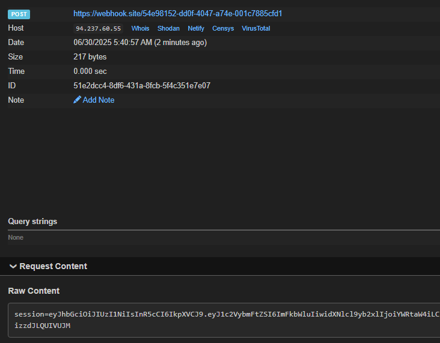

bot เก็บ flag ใน cookie

จะแสดงหน้า admin.html

halloween_name ใช้ filter | safe ทำให้เกิด XSS

https://jinja.palletsprojects.com/en/stable/templates/#working-with-automatic-escaping

Auto Escape {{ request.halloween_name }}

{{ request.halloween_name | safe }} จะทำ XSS ได้

Nunjucks และ Jinja2 เป็น template engines ที่มีความคล้ายคลึงกันมาก เนื่องจาก Nunjucks ได้รับแรงบันดาลใจมาจาก Jinja2 

Jinja2 (Python),Nunjucks (JavaScript/Node.js)

มีการใช้ CSP (Content Security Policy) เป็นกลไกความปลอดภัยที่ช่วยป้องกันการโจมตีแบบ XSS (Cross-Site Scripting) และการโจมตีอื่นๆ โดยการควบคุมว่าเว็บไซต์สามารถโหลดทรัพยากรจากแหล่งใดได้บ้าง

https://csp-evaluator.withgoogle.com/

JSDeliver เป็น CDN ฟรีที่ออกแบบมาเพื่อการส่งมอบไฟล์ JavaScript, CSS และไฟล์อื่นๆ โดยเฉพาะสำหรับ open source projects

https://cdn.jsdelivr.net/gh/user/repo@version/file

ใช้ทำ webhook cookie โดยสร้าง JavaScript บน github

