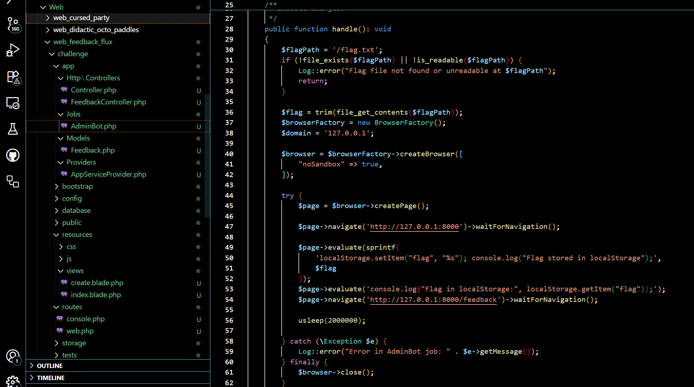
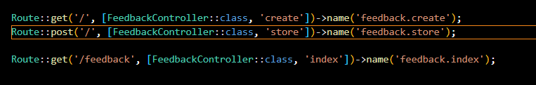
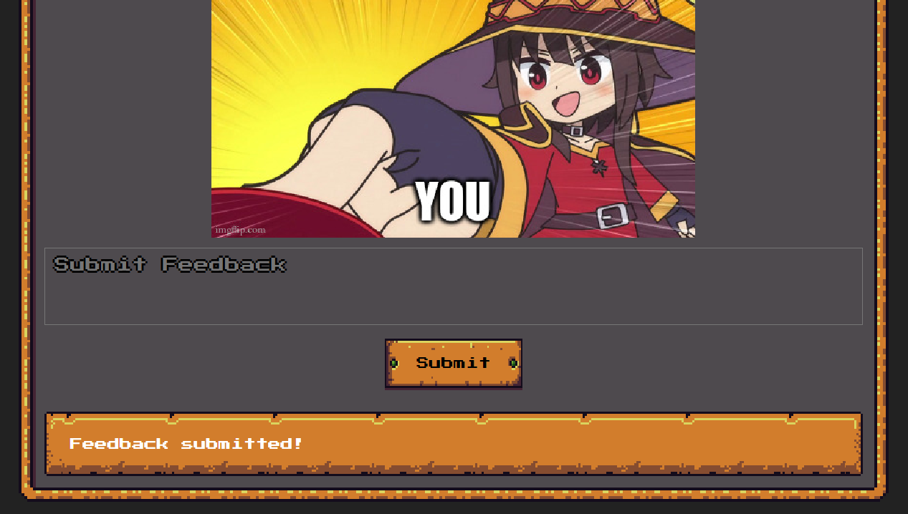
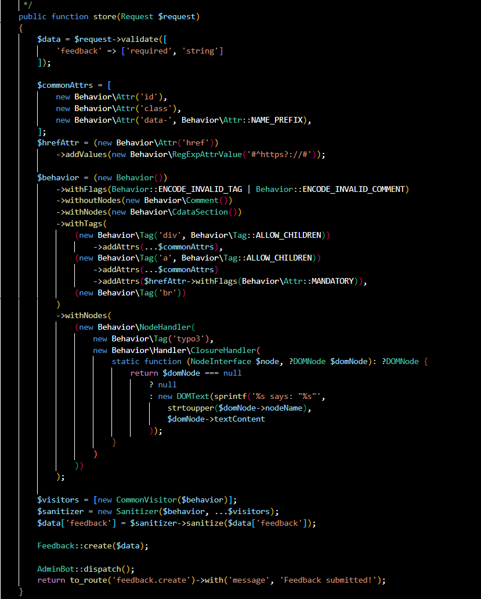
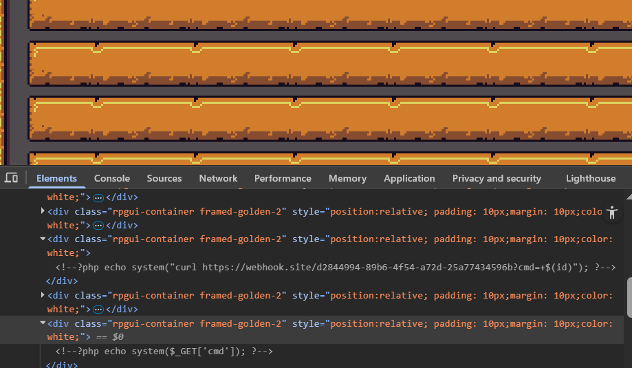
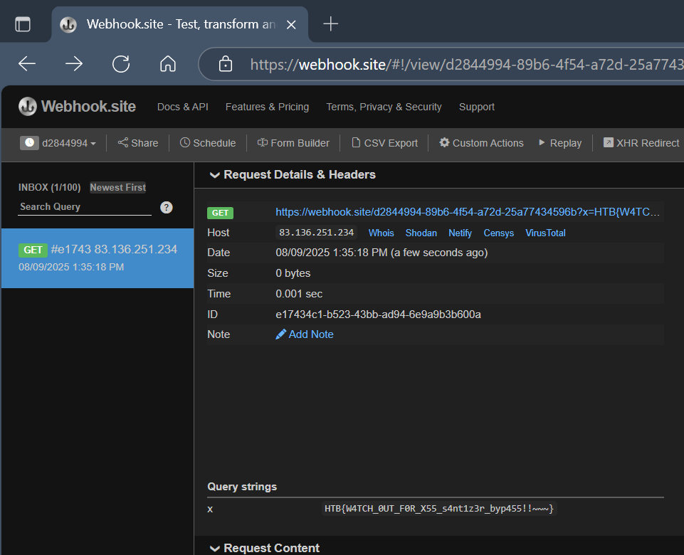

bot เก็บ flag ไว้ใน local storage







## Tags ที่อนุญาต:

### 1. `<div>` tag
```php
(new Behavior\Tag('div', Behavior\Tag::ALLOW_CHILDREN))
    ->addAttrs(...$commonAttrs),
```
- สามารถมี child elements ได้
- อนุญาต attributes: `id`, `class`, `data-*`

### 2. `<a>` tag  
```php
(new Behavior\Tag('a', Behavior\Tag::ALLOW_CHILDREN))
    ->addAttrs(...$commonAttrs)
    ->addAttrs($hrefAttr->withFlags(Behavior\Attr::MANDATORY)),
```
- สามารถมี child elements ได้
- อนุญาต attributes: `id`, `class`, `data-*`, `href` (บังคับ)
- `href` ต้องขึ้นต้นด้วย `http://` หรือ `https://` เท่านั้น

### 3. `<br>` tag
```php
(new Behavior\Tag('br'))
```
- Self-closing tag
- ไม่สามารถมี child elements ได้
- ไม่มี attributes ที่อนุญาต

### 4. `<typo3>` tag (พิเศษ)
```php
new Behavior\Tag('typo3')
```
- จะถูกแปลงเป็น text แทนที่จะแสดงเป็น HTML
- จะกลายเป็น: "TYPO3 says: [เนื้อหาภายใน tag]"

## สิ่งที่ไม่อนุญาต:
- Tags อื่นๆ เช่น `<p>`, `<span>`, ``, `<script>`, `<style>` ฯลฯ จะถูก encode หรือลบออก
- HTML comments (`<!-- -->`) จะถูก encode
- Tags ที่ไม่ถูกต้องจะถูก encode

## ตัวอย่างการใช้งาน:
```html
<!-- ✅ อนุญาต -->
<div id="content" class="container">
    <a href="https://example.com">Link</a>
    <br>
</div>

<!-- ❌ จะถูก encode หรือลบ -->
<p>Paragraph</p>
<span>Text</span>

```




```
<?xml >s ?>

<?xml >s ?>

<?xml >s ?>
```

https://github.com/Masterminds/html5-php/issues/241

