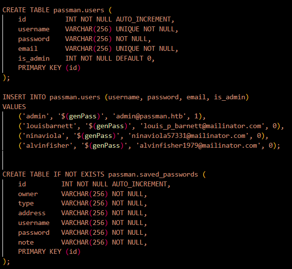
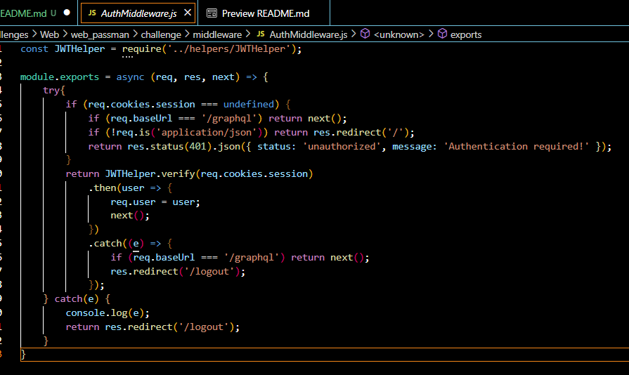

passman เป็น web app ที่ใช้เก็บรหัสผ่านของ service ต่างๆ ของผู้ใช้

จะเห็นว่าใช้ user 'admin' จะเก็บรหัสผ่านเป็น flag ไว้ ดังนั้นเราจะต้อง login as admin

พบว่ามี function UpdatePassword ที่สามารถใช้กับ user ใดๆ มาจาก Auth validate ไม่ครอบคลุม

