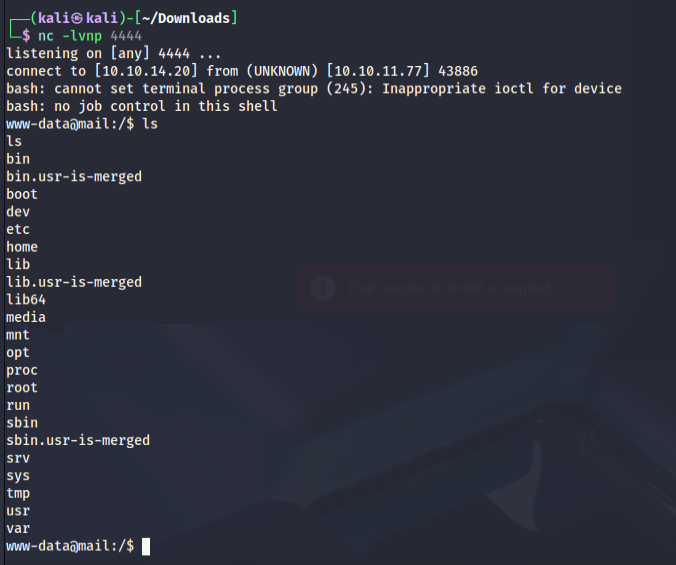

https://github.com/hakaioffsec/CVE-2025-49113-exploit

mysql -u roundcube -p'RCDBPass2025' -h localhost roundcube

www-data@mail:/$ su tyler
รหัสผ่าน: LhKL1o9Nm3X2

tyler@mail:/var/www/html/roundcube/config$ cat config.inc.php.sample 

// This key is used to encrypt the users imap password which is stored

// in the session record. For the default cipher method it must be

// exactly 24 characters long.

// YOUR KEY MUST BE DIFFERENT THAN THE SAMPLE VALUE FOR SECURITY REASONS

$config['des_key'] = 'rcmail-!24ByteDESkey*Str';

https://github.com/roundcube/roundcubemail/blob/master/config/defaults.inc.php

tyler@mail:su jacob

Password: 595mO8DmwGeD

ssh jacob@10.10.11.77

password : : gY4Wr3a1evp4

run linpea as jacob

https://book.hacktricks.wiki/en/linux-hardening/privilege-escalation/index.html#writable-files

ใช้ symbolic link อาจจะเท่กว่า ?

