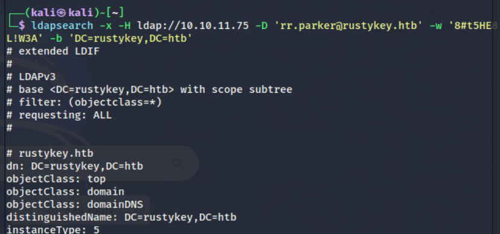
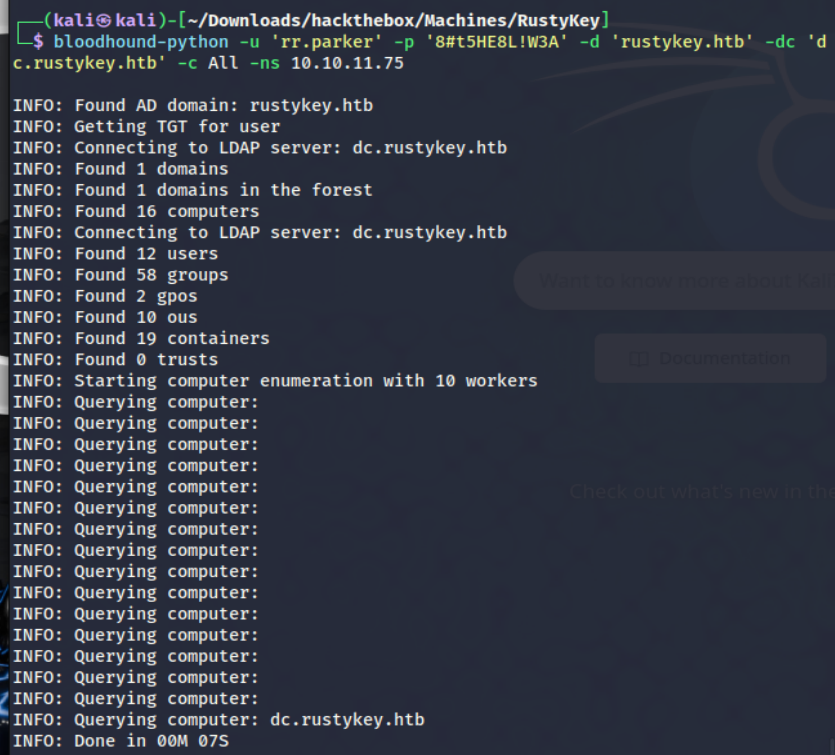

ldapsearch -x -H ldap://10.10.11.75 -D 'rr.parker@rustykey.htb' -w '8#t5HE8L!W3A' -b 'DC=rustykey,DC=htb'

bloodhound-python -u 'rr.parker' -p '8#t5HE8L!W3A' -d 'rustykey.htb' -dc 'dc.rustykey.htb' -c All -ns 10.10.11.75

